# 3DCS Variation Analyst —— 完整功能分析与复刻开发手册

> 本文档逐页分析 **3DCS Variation Analyst**（DCS 公司三维公差变差分析软件）官方帮助手册
> （https://community.3dcs.com/help_manual/），目标是一份「照着就能复刻开发」的工程级手册：
> 每个子界面、每个算法、每个图标、各子窗口调用关系、参数说明与取值范围、详细操作步骤，配界面截图。
>
> **截图**：手册原图已下载到 `images/` 目录，本文用本地相对路径引用。
> **撰写方式**：内容经重新组织与提炼，用于技术学习与架构复刻参考。
> 3DCS、CATIA、NX、Creo、SolidWorks、3DEXPERIENCE 等为各自所有者商标，图片版权归 DCS 公司，不作再分发。

---

## 软件一句话定位

**CAD 集成的蒙特卡洛三维公差仿真器 + 灵敏度优化器**。对多工位装配体做尺寸变差分析（DVA），
预测量产变差量并定位变差来源。竞品：Siemens VSA、Sigmetrix CETOL 6σ。

---

## 目录

- [第 0 章 · 总览与架构](#第-0-章--总览与架构)
  - [0.1 软件定位与产品配置](#01-软件定位与产品配置)
  - [0.2 顶层架构与数据流](#02-顶层架构与数据流)
  - [0.3 仿真核心循环](#03-仿真核心循环)
  - [0.4 窗口调用关系总图](#04-窗口调用关系总图)
  - [0.5 复刻路线图](#05-复刻路线图)
- [第 1 章 · 入门（Getting Started）](#第-1-章--入门getting-started)
- [第 2 章 · 关键信息（许可/共享计算/系统要求）](#第-2-章--关键信息许可共享计算系统要求)
- [第 3 章 · 功能与操作（Features & Operations）](#第-3-章--功能与操作features--operations)
  - [3.1 Model Navigator 模型导航器](#31-model-navigator-模型导航器)
  - [3.2 Update 更新函数](#32-update-更新函数)
  - [3.3 Extract 提取函数](#33-extract-提取函数)
  - [3.4 Features 特征与点](#34-features-特征与点)
  - [3.5 Data 数据管理](#35-data-数据管理)
  - [3.6 Validation 校验](#36-validation-校验)
  - [3.7 Display 显示](#37-display-显示)
  - [3.8 Preferences 偏好设置](#38-preferences-偏好设置)
  - [3.9 Save/Load 与文件格式](#39-saveload-与文件格式)
- [第 4 章 · Moves 移动模块](#第-4-章--moves-移动模块)
- [第 5 章 · Tolerances 公差模块](#第-5-章--tolerances-公差模块)
- [第 6 章 · Measures 测量模块](#第-6-章--measures-测量模块)
- [第 7 章 · 统计分析与仿真引擎](#第-7-章--统计分析与仿真引擎)
- [第 8 章 · 图形分析与报告输出](#第-8-章--图形分析与报告输出)
- [第 9 章 · AAO 高级分析与优化器](#第-9-章--aao-高级分析与优化器)
- [第 10 章 · Mechanical 机构建模](#第-10-章--mechanical-机构建模)
- [第 11 章 · FEA Compliant 柔性件建模](#第-11-章--fea-compliant-柔性件建模)
- [第 12 章 · CAD 平台集成](#第-12-章--cad-平台集成)
- [第 13 章 · User DLL 二次开发](#第-13-章--user-dll-二次开发)
- [第 14 章 · 教程与附录](#第-14-章--教程与附录)

> **进度说明**：本手册按章节分批撰写并持续追加。下方各章节随抓取进度逐步填充完整。
> 旧版的 13 篇分模块分析文件（`00`~`12` 开头）保留作为速查；本 README 是带截图与详细操作步骤的整合版。

---

## 第 0 章 · 总览与架构

### 0.1 软件定位与产品配置

3DCS Variation Analyst（VA）对多工位装配体做三维公差链分析，预测装配体在量产中的变差量，并定位变差来源，
从而在产品开发阶段评估零件公差、装配工装、装配顺序是否满足配合与功能要求。

可作为插件运行于 CATIA V5、NX、Creo、SolidWorks、3DEXPERIENCE，也有独立 Multi-CAD 版；
保持与 CAD 几何链接，CAD 改动后可自动更新；支持 Windchill / Teamcenter / 3DEXPERIENCE / SmarTeam PLM。

**产品配置与许可分级**（决定模块装载）：

| 配置 | 含义 | 关键限制 |
|------|------|---------|
| **3DCS Variation Analyst (VA)** | 完整版，蒙特卡洛 + 全部 Move/Tolerance/Measure | — |
| **Design Variation Modeler (DVM)** | 方程法子集，单工位、平面/轴向定位 | 仅方程法，无蒙特卡洛 |
| **Mechanical Variation Modeler (MVM)** | 含 Joints/Constraints，建模连杆机构 | 悬架/换挡/起落架/门/开关/发动机 |
| **3DCS Viewer** | 仅结果可视化与动画 | 只读 |
| **Advanced Analyzer & Optimizer (AAO)** | 灵敏度分析与公差优化（CTI/TO/SBS/SO/DO） | 单独许可 |
| **FEA Compliant Modeler (CM)** | 基于 FEA 的柔性件变形建模 | 单独许可 |
| **Mechanical Modeler (MM)** | 完整机构（约束/关节/运动学/齿轮） | 单独许可 |
| **Visualization Export** | 高端 3D 可视化（光线追踪）导出 | 单独许可 |

### 0.2 顶层架构与数据流

```
┌──────────────────────────────────────────────────────────────────────┐
│                          CAD 宿主 / Multi-CAD 独立壳                     │
│   CATIA V5 │ NX │ Creo │ SolidWorks │ 3DEXPERIENCE │ 独立 HOOPS 窗口     │
└───────────────┬──────────────────────────────────────┬────────────────┘
                │ CAD 适配层 (几何读取/PMI提取/装配树映射) │
┌───────────────▼──────────────────────────────────────▼────────────────┐
│                       3DCS 应用层 (UI + 业务逻辑)                        │
│  Model Navigator(Logic Tree) │ MTM 编辑器 │ 分析窗口 │ 报告/可视化        │
└────────┬────────────────────────────────────────────────────────────────┘
┌────────▼────────────────────────────────────────────────────────────────┐
│                         3DCS 数据模型 (内存对象图)                        │
│  Assembly Tree ─ Parts ─ Points/Features ─ GD&T ─ Tolerances ─ Moves ─    │
│  Measures ─ Distributions ─ Process Capability DB ─ Model Variants        │
└────────┬────────────────────────────────────────────────────────────────┘
┌────────▼────────────────────────────────────────────────────────────────┐
│                       计算内核 (Solver / Engine)                          │
│  几何内核 │ Move 求解器(21种) │ Tolerance 抽样器 │ Measure 求值器 │        │
│  Monte Carlo 引擎 │ GeoFactor 线性化 │ FEA 柔性求解 │ 机构运动学 │ AAO 优化│
└──────────────────────────────────────────────────────────────────────────┘
```

### 0.3 仿真核心循环

```python
for trial in 1..N:                       # N = 2137(默认收敛) ~ 20000(推荐)
    reset_all_parts_to_nominal()
    for tol in active_tolerances(child→parent order):   # 固定遍历顺序保 seed 可复现
        dev = sample(tol.distribution, tol.range, tol.mean, tol.sigma)
        apply_deviation(tol.feature, dev)               # GD&T: size→datum→referenced tol
    for move in active_moves(tree order):               # 严格按 Logic Tree 顺序
        relocate_parts(move)                            # 6DOF 刚体变换(或柔性变形)
    for meas in measures:
        record[meas].append(evaluate(meas))             # 每 build 一标量
for meas: stats[meas] = summarize(record[meas])         # μ,σ(/n),6σ,Cp,Cpk,%out,直方图
```

### 0.4 窗口调用关系总图

```
        Model + Moves + Tolerances/GD&T
               │
   ┌───────────┼────────────┐ (预验证: Graphical Analysis)
   ▼                        ▼
Nominal Build/Assemble/   Deviate/Sweep/HLM
Separate/Animation        (注入变差,可视化传递)
   └────────► Nominal Build(前置) ◄────────┘
               │
               ▼  Run Analysis(MC/Contributor/GeoFactor)
      Simulation Window ← 必须保持打开(供 Color Contour + Report)
   ┌───────────┼────────────┬────────────┐
   ▼           ▼            ▼            ▼
Show Graph  Color Contour  Report Gen   AAO 矩阵(GeoFactor/CTI/SBS/TO/SO/DO/LSA)
```

**关键耦合点**：
1. **Model Navigator 是建模中枢**：所有 MTM 通过它右键/拖放创建。
2. **Nominal Build 是枢纽态**：又是所有统计分析的强制前置。
3. **Simulation Window 是数据源单点**：Color Contour、Report、AAO 都从它取数。
4. **Logic Tree 节点顺序 = 装配序列 = 仿真执行顺序**。

### 0.5 复刻路线图

```
阶段1 几何与数据底座: 几何内核 → 数据模型(有序树/4种点/Feature双层/6种方向)
阶段2 公差链核心引擎: Move求解器(Six-Plane通用解) → Tolerance抽样器 → Measure求值器
                     → Monte Carlo引擎(固定遍历顺序) → 统计量/直方图
阶段3 分析与可视化:   GeoFactor/Contributor灵敏度 → Color Contour → Sweep/Deviate → Report
阶段4 高级优化专业模块: AAO(SBS/TO/SO/DO/CTI) → Mechanical(约束求解+DOF记账+运动学+齿轮)
                       → FEA Compliant(刚度矩阵缩聚+线性叠加)
阶段5 扩展集成:       User DLL桥接(C ABI) → CAD适配层 → PLM集成
```

**复刻者必记 10 条核心语义**：
1. Logic Tree 节点顺序 = Move 执行顺序 = 装配/制造序列；数据用有序树，拖放重排即改工艺。
2. 仿真循环固定遍历顺序（child→parent，tol→move→meas）→ seed+runs 可复现。
3. 公差统一中间表示 `{Rand#[], Distribution, Range, Offset, SigmaNum, Truncation, RangeScale, GeomRule}`；`SigmaNum=(Max−Min)/6`。
4. σ 用 /n（总体方差），非 /(n−1)。
5. 灵敏度矩阵 = High-Low 差商；贡献度按 `GF²σ²` 平方比例分配；Worst Case 算术和 vs RSS 平方和双轨。
6. Move 统一抽象：求 (R,t) 使 N 个标量约束满足，Six-Plane 是通用求解器。
7. GD&T 被解耦为单一控制项；GD&T Measure 全部降解为 Point Distance 集合取最大。
8. 方向系统 6 type 是 MTM 引擎基石：Type-In 用 LCS，其余 GCS，自动归一化 IJK。
9. Mechanical DOF 用约束雅可比的秩判断；Drop DOF 双模式（方程消解 / ~120 个 case 匹配）。
10. FEA 柔性约束只被柔性 Move 识别——求解器分层：刚体先定位，柔性叠加 `{d}=[K]⁻¹{F}`。

---

## 第 1 章 · 入门（Getting Started）

### 1.1 欢迎与版本信息（welcome.htm）
> **来源页**：`welcome.htm`

3DCS Variation Analyst 帮助手册的首页/入口页。说明当前文档对应的软件版本（手册标注 8.2.1.0），引导用户通过目录与索引进入各功能主题。该页只有公司 Logo 和导航，无功能截图。


**复刻要点**：首页只需承载版本号与目录导航，无功能逻辑。

### 1.2 软件概述（3dcssoftwareoverview.htm）
> **来源页**：`3dcssoftwareoverview.htm`

介绍 DCS 产品线的三种配置，按建模能力分层：
- **3DCS Variation Analyst**：完整平台，基于装配过程的全功能建模与蒙特卡洛分析。
- **Design Variation Modeler (DVM)**：轻量、基于方程，面向单工位装配快速估算。
- **Mechanical Variation Modeler (MVM)**：面向含运动副与约束的复杂机构装配。

代表功能图标：运行分析  特征移动  固定副  圆柱副  运动学仿真 

| 配置 | 说明 | 适用范围 | 分析方式 |
|------|------|----------|----------|
| Variation Analyst | 完整公差建模平台 | 多工位复杂装配 | 蒙特卡洛+贡献度 |
| DVM | 简化版 | 单工位装配 | 基于方程 |
| MVM | 机构变差分析 | 含运动副/约束机构 | 运动学+蒙特卡洛 |

**复刻要点**：产品分层本质是 license/feature flag 差异，底层数据模型统一，UI 按授权裁剪。

### 1.3 3DCS 主要功能（features_3dcs.htm）
> **来源页**：`features_3dcs.htm`

核心能力：按 ASME/ANSI Y14.5 定义 GD&T，执行蒙特卡洛仿真与贡献度分析，通过"偏差网格"三维可视化结果。建模数据直接随装配文件存储。提供可选附加模块（优化、柔性件、可视化导出）。

**复刻要点**：建模数据内嵌于装配文件——需一套与 CAD 装配树绑定的持久化方案。

### 1.4 建模方法（modelingmethods.htm）
> **来源页**：`modelingmethods.htm`

创建并验证模型的标准六步：
1. 修改装配并明确建模目标。
2. 应用装配过程（定义零件如何定位、装配）。
3. 依 GD&T 标准定义各特征公差。
4. 创建测量表达考核的尺寸目标。
5. 运行蒙特卡洛仿真。
6. 输出并解读报告，确认特征落在规定范围。

**复刻要点**：六步流程即主工作流向导的步骤定义。

### 1.5 自底向上与自顶向下（bottomupandtopdownmodeling.htm）
> **来源页**：`bottomupandtopdownmodeling.htm`

- **Bottom Up**：先零件层定义公差/GD&T，再加 moves 与 measures。适合公差已知。
- **Top Down**：先定测量与目标，用子装配基准而非单零件，灵活分配公差测试多方案；支持从坐标/扫描数据生成，更新无需重生成。

**复刻要点**：两法共享同一数据结构，差异仅在录入顺序与基准引用层级，UI 不必强制顺序。

### 1.6 3DCS 功能总览（dcs-functions.htm）
> **来源页**：`dcs-functions.htm`

功能字典式全量参考，按类别罗列所有命令并配工具栏图标：
- **装配**：名义装配  装配  分离  动画 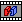 偏差 
- **测量与公差**：点距、特征测量、各类 GD&T
- **移动**：6 平面定位、特征移动、阵列、匹配，及柔性件/力学专用移动
- **运动学**：固定副  圆柱副  等
- **分析与优化**：运行分析  报告生成  CTI  GeoFactor 
- **工具/可视化**：模型导航器、选项  帮助 

**复刻要点**：这是命令清单权威来源，可直接作为命令注册表与菜单/工具栏布局依据；图标资源已下载到 `images/dvti_*.png`。

### 1.7 示例模型（examplemodels.htm）
> **来源页**：`examplemodels.htm`

示例模型/教程按安装目录组织，覆盖 CATIA V5、Creo、SolidWorks、NX、3DEXPERIENCE。提供「3DCS 版本 × CAD 版本」兼容性表；模型可跨版本迁移。

**复刻要点**：示例模型随安装包分平台分发，维护版本兼容性矩阵。

### 1.8 Creo 快捷键与鼠标（creo_shortcutkeys.htm）
> **来源页**：`creo_shortcutkeys.htm`


| 操作 | 功能 |
|------|------|
| 左键 | 选择 |
| 中键滚轮 | 缩放 |
| 中键拖动 | 旋转视图 |
| 中键滚轮+Ctrl | 平移 |
| Ctrl+C/Ctrl+V | 复制/粘贴（导航器、编辑点对话框） |
| F2 | 重命名 3DCS 特征 |

### 1.9 NX 快捷键与鼠标（nx_shortcutkeys.htm）
> **来源页**：`nx_shortcutkeys.htm`

| 操作 | 功能 |
|------|------|
| 左键 | 选择 |
| 中键/滚轮 | 缩放 |
| 右键+中键 | 旋转视图 |
| 右键+Shift | 平移 |
| 长按中键≥1秒 | 临时改旋转中心 |
| F2 | 重命名特征 |

### 1.10 CATIA V5 快捷键与鼠标（v5_shortcutkeys.htm）
> **来源页**：`v5_shortcutkeys.htm`

| 操作 | 功能 |
|------|------|
| 左键 | 选择 |
| 中键 | 平移视图 |
| 左/右键+中键 | 缩放 |
| 双键同时 | 旋转几何 |
| 中键点击 | 改旋转中心 |

> 注意：CATIA「中键=平移、双键=旋转」与 NX/Creo 相反，复刻时务必区分。

### 1.11 3DCS Multi-CAD（3dcs-and-multi-cad.htm）
> **来源页**：`3dcs-and-multi-cad.htm`

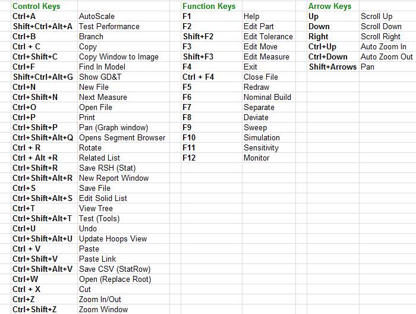

独立运行的 Multi-CAD 版输入：左键选择、中键滚轮缩放、右键菜单、双键同时旋转、Caps Lock 在树窗口浏览零件。

---

## 第 2 章 · 关键信息（许可/共享计算/系统要求）

### 2.1 访问帮助（accessing_help.htm）
> **来源页**：`accessing_help.htm`

帮助兼作参考手册与培训指南，Contents + Index 双视图。操作：Help→Index 打开；Contents 浏览或 Index 检索；Help→About 看版本/内存。

### 2.2 技术支持（technical_support.htm）
> **来源页**：`technical_support.htm`

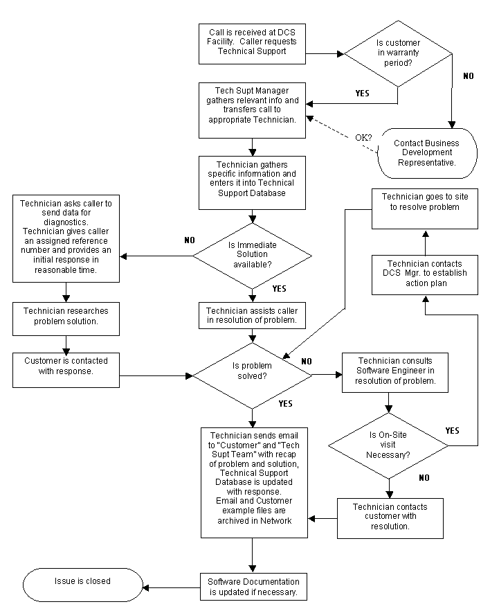

支持渠道：驻场项目经理、社区论坛、服务台。通过扩展 API 提供定制；可专有定制或联合开发并入商用产品。

### 2.3 QDMWEB（qdmweb.htm）
> **来源页**：`qdmweb.htm`


基于 Web 的质量管理系统，远程访问制造质量数据，含实时监控与 SPC 工具。

**复刻要点**：QDMWEB 是配套的独立 Web 质量平台，仿真侧作数据消费/对接方。

### 2.4 授权流程（licenseprocess.htm）
> **来源页**：`licenseprocess.htm` —— 该 URL 实际返回内容与"授权流程"主题不符（疑似手册占位/错绑页），授权实操见 2.5。

### 2.5 DCS 授权状态工具（dcslicensestatus.htm）
> **来源页**：`dcslicensestatus.htm`

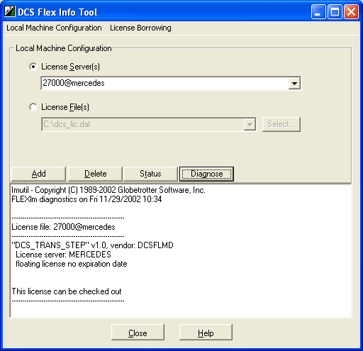

随 3DCS 自动安装。选授权来源（License Server / File），支持 `portnumber@servername` 格式。

| 按钮 | 说明 |
|------|------|
| Add | 注册新授权 |
| Delete | 删除选中授权 |
| Status | 显示服务器状态/文件内容 |
| Diagnose | 诊断检出问题 |

> 程序在加入注册表前不校验授权有效性，校验在实际 checkout 时进行。

### 2.6 硬件术语（hardwareterminology.htm）
> **来源页**：`hardwareterminology.htm`

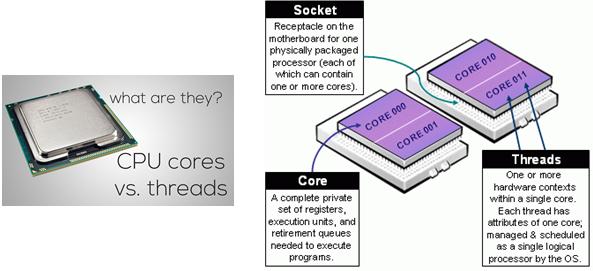 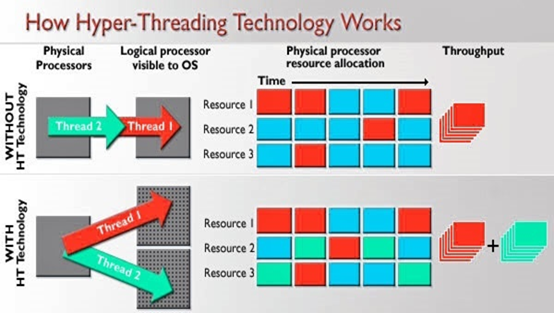

| 术语 | 说明 |
|------|------|
| Shared Memory | 可被多 CPU 使用的内存 |
| CPU Core | 独立物理处理单元 |
| Thread | 被编排执行的指令序列 |
| Logical Processor | 物理核心数 × 超线程线程数 |
| Hyperthread | 一个物理核心拆成 2 个逻辑核心 |

### 2.7 DCS 共享内存（dcs-shared-memory.htm）
> **来源页**：`dcs-shared-memory.htm`

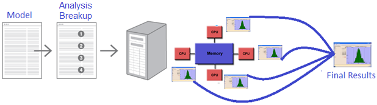 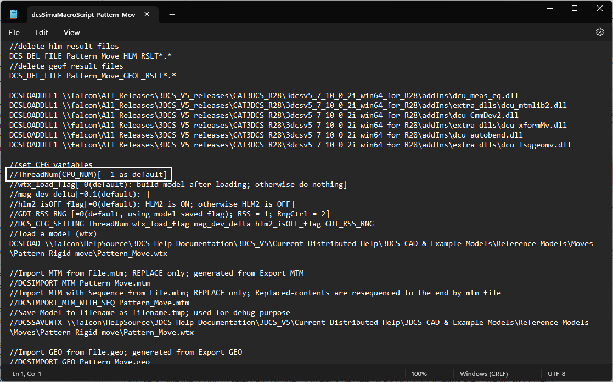

利用多线程加速分析，多逻辑处理器并行后合并结果。

| 参数 | 说明 | 范围 |
|------|------|------|
| Thread 数 | 并行线程数 | 0、1–8（多授权可至 16…64） |
| Thread=0 | 推进过程中用旧版种子生成 | — |
| Thread=1–8 | 分析前预生成种子 | 默认 |

支持：仿真、贡献度、GeoFactor、AAO-SBS、Batch Processor。线程数 ≤ 系统逻辑处理器数。

**复刻要点**：Thread=0 与 ≥1 的差异在种子生成时机（边算边生成 vs 预生成），需保留两模式以兼容旧结果复现。

### 2.8 分布式计算（distributed-computing.htm）
> **来源页**：`distributed-computing.htm`

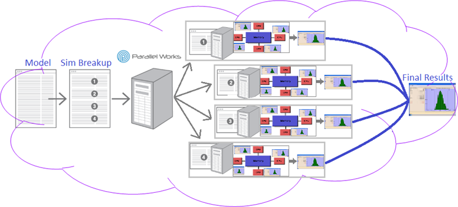 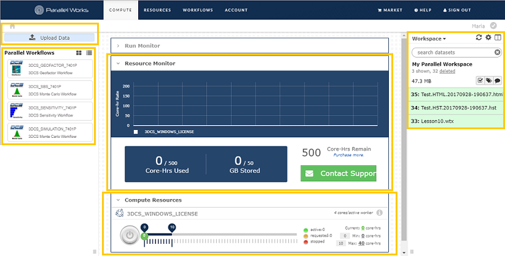

经 Parallel Works 把分析拆分到多台云端机并行再合并。后端用 Swift 生成工作流，Batch Processor 在各 worker 并行执行。

操作：Upload Data → Start Resources → Run Workflows（Simulation `3DCS_SIMULATION_7401P` / Contributor `3DCS_SENSITIVITY_7401P` / GeoFactor 已不支持）→ Monitor → Download Results。

**复刻要点**：分布式（跨机）与共享内存（单机多线程）是两套并行路径，分析引擎需抽象「拆分-分发-合并」接口。

### 2.9 系统要求（systemrequirements.htm）
> **来源页**：`systemrequirements.htm`

| 类别 | 最低 | 推荐 |
|------|------|------|
| 处理器 | Intel Core | i7、Xeon |
| 内存 | 8GB | 32GB |
| 显存 | 1GB | 4GB |
| 显卡 | NVIDIA Quadro | NVIDIA Quadro |
| 操作系统 | Windows 10 & 11 | 同 |
| Office | 2016/365(64 位) | 同 |
| Java | Java 8 | — |

> 授权与线程数绑定：每 8 线程 1 授权，上限 64 线程需 8 授权。

---

## 第 3 章 · 功能与操作（Features & Operations）

### 3.1 Model Navigator 模型导航器
> **来源页**：`modelnavigator.htm` · **图标**：
> **作用**：3DCS 全部存储数据（Points/Features/GD&T/Tolerances/Moves/Measures）的树状大纲，建模中枢入口。

#### 功能概述
显示装配结构，按 Component Name 列出零件。所有 3DCS 数据保存在**顶层装配**上。零件颜色与图形窗口一致；树展开/折叠状态在保存后持久化。

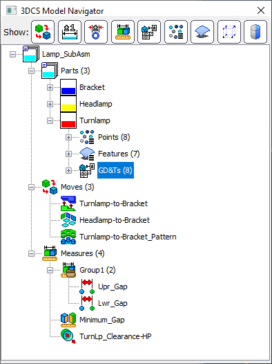

*（层级顺序固定为 Parts → Points → Features → GD&T → Tolerances → Moves → Measures。）*

#### 打开步骤
1. 在 CAD 工具栏点 **Load 3DCS** 加载。
2. 点 **Update Model**  初始化，从 Product 文件读存储结构。
3. 点 **Model Navigator**  打开窗口。
4. 用 `+ / −` 展开折叠节点。

#### Show 工具栏（节点显隐切换）
| 显示态 | 隐藏态 | 切换对象 |
|:---:|:---:|---|
|  |  | Move lists |
|  |  | Tolerance lists |
| 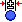 |  | Circle Size Tolerance lists |
|  |  | Measure lists |
| 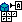 |  | GD&T lists |
| 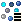 |  | Points lists |
|  |  | Features lists |
| 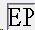 |  | Empty Parts |

#### 重命名（3 种方法）
- **右键法**：选中 → 右键 → Rename，可多选连续重命名。
- **F2 法**：选中 MTM/Point 按 `F2`。
- **慢双击法**：选中后再次慢点击。

> **命名约束**：只接受短横线和下划线；空格/句点/逗号自动转 `_`。

#### 键鼠操作
| 操作 | 方式 |
|---|---|
| 剪切/复制/粘贴 | `Ctrl+X` / `Ctrl+C` / `Ctrl+V` |
| 删除 | `Delete` |
| 高亮关联特征 | 点击 MTM；悬停用不同高亮色 |
| 拖放 | MTM/Points 在零件间移动；组件在装配间移动 |

#### Display Options（显示选项）
右键顶层装配 → Display Options：

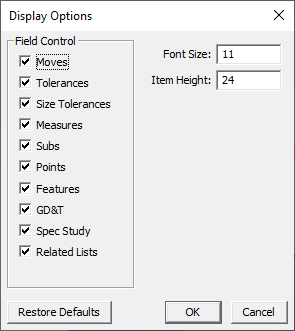

Field Control（显隐节点）、Font Size（字号）、Item Height（行间距）。

#### Branch Tree（分支聚焦，应对 1000+ 零件）
右键 Part/sub-assembly → Branch Tree（树最小化到该选择）；返回用 `[Expand to Parent]`。

#### 停靠/浮动（Multi-CAD）
左键按住标题栏拖到停靠箭头；双击标题栏回上次位置。

> **复刻要点**：Model Navigator 中 **Move 列表自上而下顺序 = 装配/制造执行顺序 = 仿真求解顺序**。数据模型须用有序树，拖放重排 Move 等价于改装配序列，直接影响仿真结果。

### 3.2 Update 更新函数
> **来源页**：`updatefunctions.htm` · **图标**：

CAD 装配变化后让 3DCS 树与之同步，同时尽量保留已建分析数据。命令组：Update Model、Feature Wizard、Update Geometry、Set Part Position、Reset Parts LCS、Update 3DCS CGR、Delete Unused Information、Remove 3DCS Data。共同前提是「3DCS 树 ↔ CAD 树」一套名称/ID 映射。

#### 3.2.1 Update Model（updatemodel.htm）
初始化与同步主命令，扫描整棵 CAD 树，检测新增/顺序/命名/颜色变化并反映到 3DCS 树。

**何时用**：首次打开、增删零件、替换改过几何的零件（之后再跑 Update Geometry）、改实例名、调顺序、平移旋转。
**步骤**：① 进 Creation Mode → ② 触发 Update Model → ③ 扫描应用差异；名称无法匹配则弹 Tree Link Wizard。
**约束**：仅创建模式可用；高版本保存的模型不允许更新；保留分析网格、跳过无谓重建以提速。
> **复刻要点**：「差异检测 + 增量应用」而非全量重建。

#### 3.2.2 Tree Link Wizard（treelinkwizard.htm）
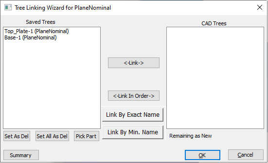

Update Model 无法自动对名时弹出，手动关联「旧名↔新名」迁移属性。
**步骤**：在 Saved Trees 与 CAD Trees 两列高亮对应 → Link；三档批量策略：Link In Order / Link By Exact Name / Link By Minimum Name（匹配度≥80%）；删除项用 Set As Del 标记。
> **复刻要点**：双列映射编辑器 +「按序/精确名/最小名」三档自动匹配 + 手动覆盖。

#### 3.2.3 Update Geometry（updategeometry.htm）
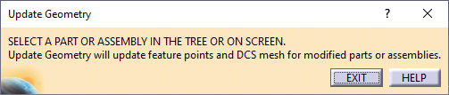

刷新改动零件的特征点坐标/矢量，重建分析与可视化 Mesh，可针对组件或整模型。
**何时用**：几何改、网格密度改、零件替换、Cylinder Threshold 改（弹警告）。
> **复刻要点**：会重建网格并更新点位置，仿真结果可能轻微变化——属预期行为。

#### 3.2.4 Set Part Position（setpartposition.htm）
把零件当前屏幕位置固化为新起始位置。装配走 Creo 流程：生成 `DCS_Exp_` 前缀爆炸视图 → Separate → Model View Manager 激活 → Update Model 锁定。

#### 3.2.5 Reset Parts LCS（resetpartslcs.htm）
把组件 LCS 恢复到原始状态，还原被平移/旋转的零件。对装配执行时连带重置所有子零件。不可选择性撤销，需二次确认。

#### 3.2.6 Update 3DCS CGR（updatedcscgr.htm）
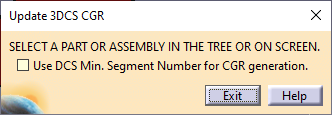 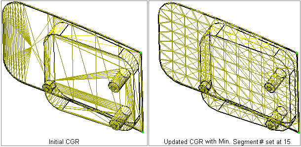

CGR 是 CATIA 零件的轻量化压缩图形表示，便于 Animation Mode 快速加载。本命令强制完全重建 CGR（普通 Update Model 为省内存只做快速扫描，可能漏掉颜色等细微改动）。
> **复刻要点**：CGR 细分变化不随模型保存；作为「按需补救」命令而非默认流程。

#### 3.2.7 Delete Unused Information / Remove 3DCS Data
Delete Unused 见 3.5.11。**Remove 3DCS Data**（remove3dcsdata.htm）从所有相关文件删除全部 3DCS 数据，高破坏性，强制二次确认。

### 3.3 Extract 提取函数
> **来源页**：`extract-functions.htm` · **图标**：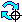

从 CAD 提取数据转为 3DCS 元素。共性：读取标注/约束 → 自动生成所需 feature/point → 映射成可编辑的 Tolerance/Move/Measure，支持 Smart Search 缩小范围。

#### 3.3.1 Extract GD&T（searchgdt.htm）
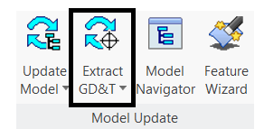 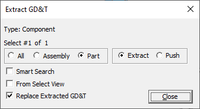

搜索 GD&T 并作为可改 Tolerance 加入，自动生成特征与点。
**命令**：Extract From（CAD→3DCS）/ Push To（改动回写 CAD）。

| 参数 | 说明 | 范围 |
|---|---|---|
| 搜索过滤 | All Components / Parts Only / Products Only | 三选一 |
| Smart Search | 仅提取被 Move/Measure 用过的特征上的 GD&T | 开/关 |
| Replace 3DCS GD&T | 删旧重建 或 更新保留改名 | 开/关 |

> **复刻要点**：双向（提取/回写）+ 范围过滤 + Smart Search + 替换/合并两策略。

#### 3.3.2 Extract Moves（extract-moves.htm）
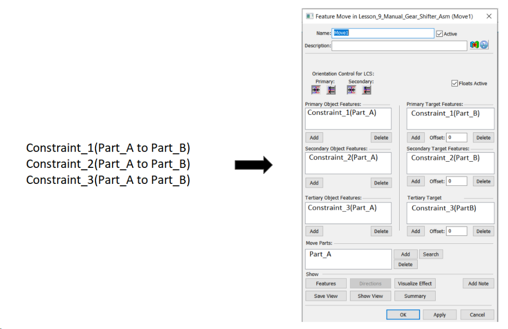 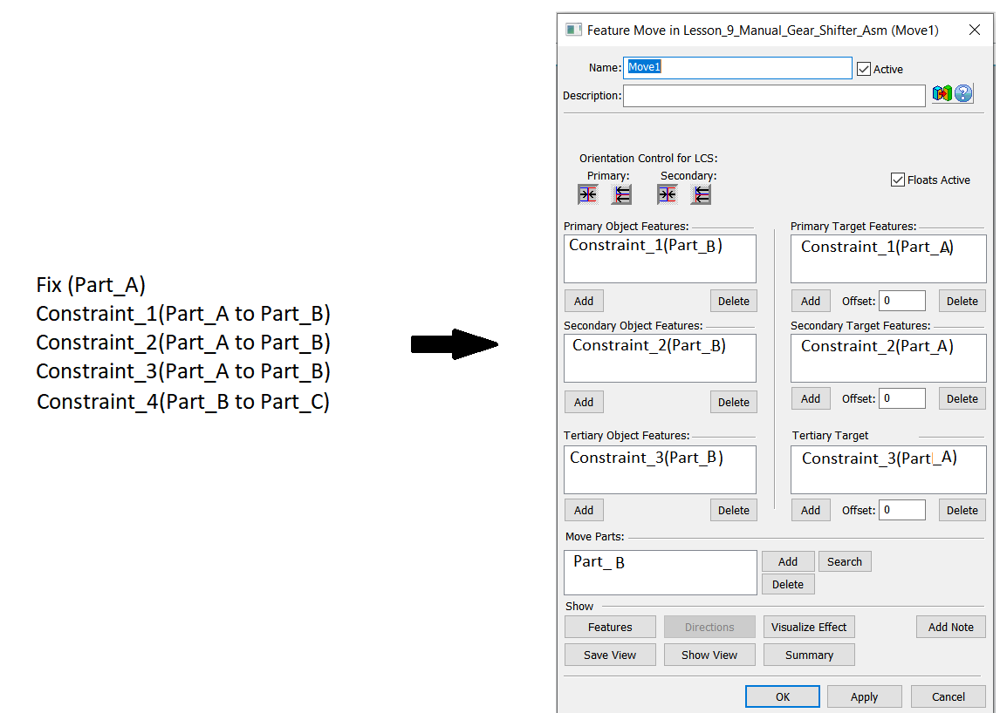

把 CAD 约束转为 Feature Move，按约束顺序建 primary/secondary/tertiary 关系。
**5 条转换规则**：① 按序组合主次三；② fixed 零件始终作 target；③ 已约束过的两零件都进 Move Part；④ 链到当前 target 的带入零件合并 move；⑤ 合并时自动交换 object/target 保主次对齐。
支持约束：CATIA(Coincidence/Contact/Offset)、Creo(Coincident/Distance/Centered)、NX(Touch-Align/Distance/Align Lock)、SolidWorks(Coincident/Concentric/Distance)。
> **复刻要点**：约束→Move 非逐条直译，按 5 规则推导主次；offset 值可能因 target 选择而建错。

#### 3.3.3 Extract GD&T Measurement（extractgdtmeasurement.htm）
识别 GD&T 并作为可调 Measurement 加入，捕获 Datums 归入 GD&T Folder。支持 Position/Perpendicularity/Parallelism/Angularity/Surface Profile/Concentricity。参数同 3.3.1（范围/替换/Smart Search）。

#### 3.3.4 Extract Measures（extractmeasures.htm）


CAD 分析测量 → Feature Measure；带公差标注尺寸 → Dimensional Distance（公差填规格限）。
**前提**：尺寸须含公差、须建在恰好两特征间。
平台做法：CATIA(Tolerance Advisor)、3DEXPERIENCE(Leaf Product + 3D Tolerance)、SolidWorks(Location Dimensions)、NX(Simple Distance / Linear Size Tolerance)。

### 3.4 Features 特征与点
> 完整的几何实体数据模型、4 种点类型、Mesh 双层模型、6 种方向系统、特征创建与显示，见配套文件 [03-界面框架与特征点系统.md](03-界面框架与特征点系统.md)。核心要点：
> - **4 种点**：Coordinate Point（纯 XYZ 可编辑）/ Feature Point（绑定面，UV 0~1）/ Dynamic Point（派生）/ Feature Locator Point（每特征自带）。
> - **Mesh 双层**：Solid Feature（CAD 面 `MeshFeatSurf`）↔ Analysis Feature（3DCS 跟踪节点，含 MeshNodeNum/CadPtNum）。
> - **6 种方向**：Type In(LCS)/Two Points/Normal/AssocDir/PickPtDir/Auto，自动归一化 IJK。

### 3.5 Data 数据管理
> **来源页**：`data.htm` · 日志默认存 `C:\Users\<user>\AppData\Local\DCS\DCS_V5\Logs`。

#### 3.5.1 Copy Data（copydata_2.htm）
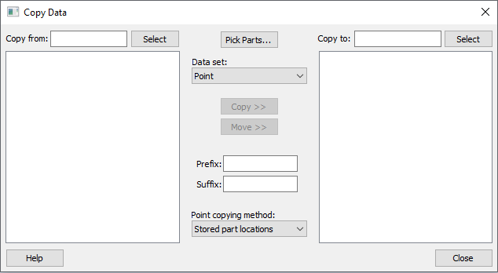

零件/装配间复制/迁移 points/measures/tolerances/moves。坐标系方法 Global/Local；Stored Part Location 处理被移动零件；可加前缀/后缀。
> **复刻要点**：Measure/Tolerance 复制时其关联 point **不会自动带过去**，需单独复制——易错点。

#### 3.5.2 Edit Part（editpart.htm）
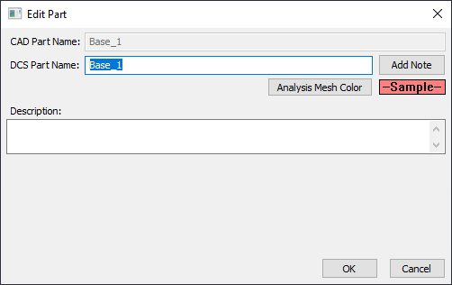 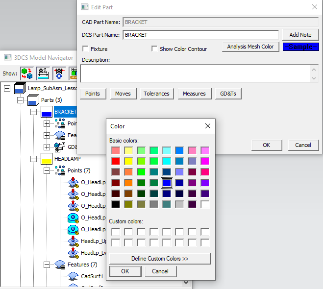

双击零件节点打开。CAD 部件名只读（仅装配里改）/ DCS 部件名可改；可加注释；网格/点颜色可改；Fixture 配置（子装配移动时夹具不动）；HSF 集成。

#### 3.5.3 Find/Replace（findinmodel.htm）
查找批量编辑实体名。Find 自动通配；替换两式：Replace Sub-string（只换匹配片段）/ Replace String（整名）；Replace Term 不支持通配。

#### 3.5.4 Mirror（mirror.htm）
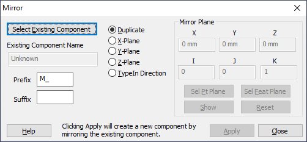

points+MTMs 从源到镜像/复制零件（须先在 CAD 镜像几何）。Duplicate（保朝向）/ Mirror（反朝向）。前缀/后缀只加 MTM/GD&T 不加点。源/目标树结构须一致。

#### 3.5.5 Excel Data Storage（excel-data-storage.htm）
需 Excel Create 授权。Write to Spreadsheet 导出 → Excel 改 → Read 导入。Tab：Tolerance/GD&T/Moves/Measures/Points/Spec Study/Geometry 等。约束：同零件特征须连续无空行；数字名加撇号 `'1`；**GD&T 不能经导入创建**；版本单向兼容。

#### 3.5.6 Feature Information（information.htm）
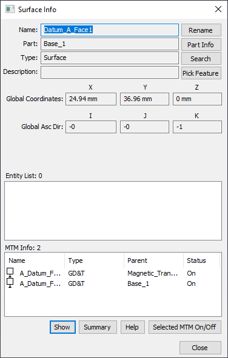

显示两套坐标系下位置与矢量、关联实体及近似直径、引用该点的全部 MTM。

#### 3.5.7 MTM/GD&T Information（mtmgdtinformation.htm）
装配/子装配级集中显示 Moves/Tolerances/Measurements/GD&T；下拉切换类型、双击直达编辑、列可排序。

#### 3.5.8–3.5.10 Backups（backups.htm / create-backup.htm / restore-backup.htm）
WTX 快照，手动（Save Backup）+ 自动（每次 Update Model 时）两类统一管理。仿真/更新运行时不执行备份。命名：手动 `Assembly_CustomName_Date_Seq.WTX`，自动 `Assembly_Date_Seq.WTX`。

#### 3.5.11 Delete Unused Information（delete_unused_information.htm）
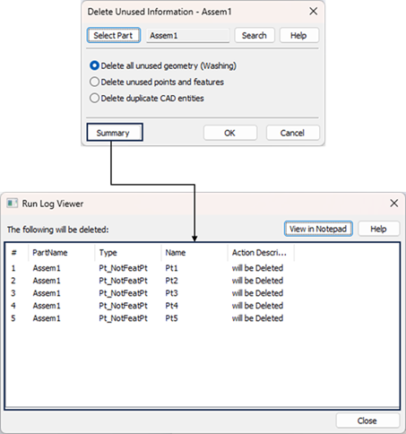

只保留实际参与 moves/measures/tolerances 的数据。选项：Delete All Unused Geometry / Delete Unused Points and Features / Delete Duplicate CAD Entities / Summary（预览）。
> **复刻要点**：删除前能 Summary 预览；以「是否被 MTM 引用」作保留判据，显著减小文件提升大装配性能。

#### 3.5.12 Screen Check（screencheckfunctions.htm）
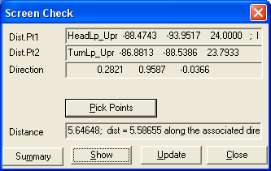

图形窗选点提取几何信息：Distance(2点)/Angle(4点)/Normal Vector(3点)/Vector Normal to Line。纯查询，不改模型。

### 3.6 Validation 校验
> **来源页**：`validate.htm` · **图标**：

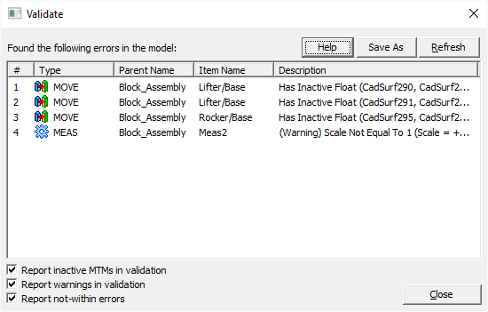

两阶段：Pre-Analysis（MC/Contributor 前，写 `DCSModel.txt`）/ Post-Analysis（执行中，写 `DCS_run.txt`）。**双击问题项直达对应 MTM 编辑**。

#### 3.6.1 GD&T Checker & Relationship Wizard（relationships.htm）
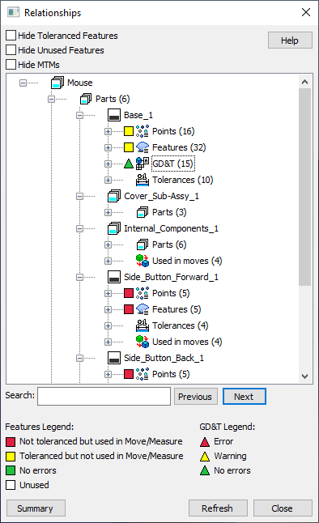

树形展示 features/points↔MTMs 关联，识别 GD&T 错误/警告/未用特征。公差处理顺序：**size→form→orientation→location→pattern→dimensions**。

#### 3.6.2 Before-Analysis Validation（before-analysis-validationva.htm）
区分「阻止仿真的错误」与「允许继续的警告」，按 Move/Tolerance/Measure/GD&T/Feature 分类。常见：空零件列表、缺特征、方向矢量平行、动态点冲突、同特征重复加公差、DRF 错误。

#### 3.6.3 After-Analysis Validation（after-analysis-validation.htm）
仿真后自动运行。**Move 错误致装配失败**（干涉/共线/奇异矩阵/无解）；**Measure 错误只返回 0 值**；Tolerance 配置错误需修正。

#### 3.6.4 Compliant Modeler Validation（validate-compliant-modeler.htm）
柔性专属错误：Move 类型、User-DLL（缺 exe/函数）、Joins/Clamps（夹紧力不足/未夹紧点）、FEA 刚度矩阵（节点缺链接，用 Refresh ASET Links 或 StiffGen 重生成）。

### 3.7 Display 显示
> 见配套 [03-界面框架与特征点系统.md](03-界面框架与特征点系统.md) §6。要点：Hide/Show Mesh、Hide/Show Points、Label Features、Tree Icons（树图标含义）、Animation Window、右键上下文菜单、Display Options（4 Tab：General/Appearance/Effects/Performance）。

### 3.8 Preferences 偏好设置
> 见配套 [02-建模工作流与支撑模块.md](02-建模工作流与支撑模块.md) §1。9 分页：General / Analysis / Validation / Model Settings / Tolerance-Distribution Defaults / MTM Defaults / Display / Alias Display / External App。
> **持久化双作用域**：机器级 Config 文件 + 模型级（随 WTX）。关键默认：GD&T Standard=ASME、Cylindrical Threshold=95°、Six Sigma Z0=1.5、Mesh Density 标准4/CATIA6/NX8。

### 3.9 Save/Load 与文件格式
> **来源页**：`saveload.htm`

#### 3.9.1 Saving in a CAD System（saving-in-a-cad-system.htm）
标准保存（Save/Save As/Save All）自动把 3DCS 数据随主装配保存；空零件不落盘。
> **重要限制**：**Nominal Build 态下禁止保存/关闭**，须先 Separate。

#### 3.9.2 Add/Update Publications（updatepublications.htm）
在 Publications 与 CAD 间建连接，导入 WTX 时自动恢复 CAD 链接，省去手动 Feature Linking Wizard。

#### 3.9.3 Shrink Wrap（shrink-wrap.htm）
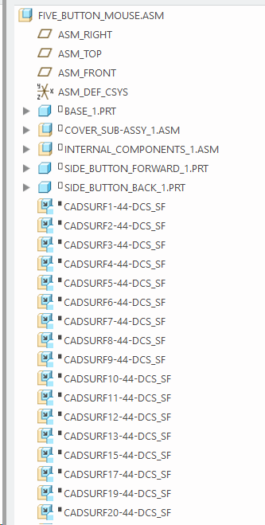

复刻 Creo shrinkwrap：把 3DCS 特征物化为 Creo 曲面以承载链接，使 WTX 在上层装配自动重连。

#### 3.9.4 Export 3DCS File（exportdcsfile.htm）
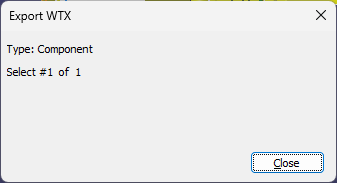

| 格式 | 内容 |
|---|---|
| **WTX** | XML 全量（装配/moves/GD&T/tolerances/measures/points/features），主格式 |
| WT3 | 旧版文本 |
| GEO | 单零件参数化坐标点 |
| MTM | 仅 moves/tolerances/measures |
| DCSDB2 | 点元数据 + 偏差值 |

单位统一 mm/度；可用内存 <500MB 触发警告。

#### 3.9.5 Import 3DCS File（importdcsfile.htm）
支持 WTX/WT3/GEO/MTM/DB2/DEV。**零件匹配顺序**：Part ID → CAD Part Name → 3DCS Part Name。
三模式：Merge（更新+新增）/ Replace（覆盖+删多余）/ Append（新建子装配）。名不匹配弹 Tree Link Wizard。

#### 3.9.6 Import/Export Sub-assembly（import-subassembly.htm）
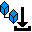

子装配↔主装配传数据，两文件须均打开并 updated。Merge/Replace/Append。**新建零件须先 Update Model 再导入**防重复。

#### 3.9.7 Open 3DCS File（opendcsfile.htm）
先新建 Assembly，再选 3DCS 文件。打开 WTX 时自动填充零件树，**无需 Update Model** 即可分析。

#### 3.9.8 Save To / Save Summary（saveto.htm）
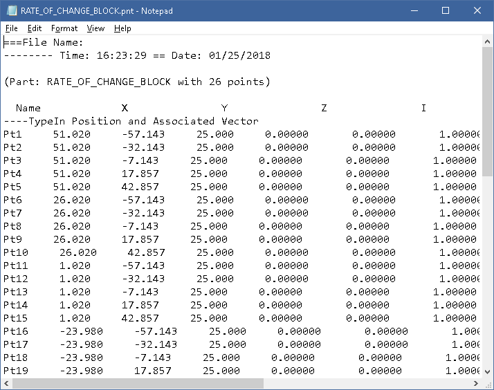

导出 Points/Moves/Tolerances/Measures 详情，扩展名 `.pnt`/`.mpv`/`.tol`/`.msr`，View 走 Notepad 预览。

#### 3.9.9 Default Settings（defaultsettings.htm）
程序关闭时自动保存配置到 `dcs_config.ini`（用户本地目录）+ 各子模块 ini。Alias/缩写文件须放进 Config 目录才生效。

---

## 第 4 章 · Moves 移动模块

### 4.0 Moves 总论与通用参数
> **来源页**：`definingmoves.htm` · `movecommonparameters.htm` · `moveoptions.htm` · `bendroutines.htm`

#### Move 是什么
Move 描述「一个零件如何相对另一个零件被定位」的刚体操作。每个 Move 把被移动件（Object）当刚体，求一个 6 自由度（3 平移+3 旋转）刚体变换，使 Object 上选取的点/特征对齐到 Target 上对应点/特征。Move 不改 CAD 几何，只改实例位姿（Thermal Scaling/Bend/LSQ Axis 例外，移动网格点/特征点）。

**执行顺序**：按 **Logic Tree 中 Move 列表自上而下顺序**依次执行。未完全约束类 Move（如 Pattern Rigid 只约束次/三向）必须先放一个定好主向的 Move（如 Three-Point）。

#### 创建/编辑/复制（操作步骤）
1. Logic Tree 选装配节点 → 打开 Move List 对话框。
2. 点 **[Add New]** → 在 Types of Moves 选类型 → 进参数对话框。
3. 修改：选中 → **[Modify]**；删除：选中(Ctrl 多选) → **[Delete]**；复制：右键或 **[Quick Copy]**；排序：**[Switch To]** 或上下箭头；转换：**[Change Type]**（仅兼容类型间）。


#### 通用参数表
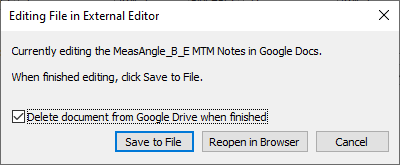

| 参数 | 说明 |
|---|---|
| Name | Move 名称（报告与浮动贡献度追溯用） |
| Move Active | 是否启用 |
| Animation | 仿真时做动画 |
| Options | 进孔/销浮动、Bend、Condition、Iteration |
| Object/Target Features/Points | 被移动件/基准件上的定位点或特征 |
| Move Parts | 实际移动的零件清单 |
| Show Direction/Features | 3D 高亮方向/点特征 |

**Directions 区**：每个方向含 Index（序号）、Type（向量来源，6 种）、Number（需要的方向数）、Mode（按 Object/Target Plane 解释）。

#### Move Options：孔销浮动/条件/迭代逻辑
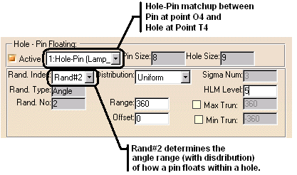

**(1) Hole/Pin Float**：模拟销在间隙内随机漂移。Rand#1 Magnitude（漂移距离+分布）、Sigma Number(1–8，默认3)、Range Scale(默认1)、Rand#2 Angle Range(默认360°)、Angle Offset(0°)、Min/Max Truncation。浮动方法：Phantom Point / Interference Checking(Jiggle) / Pattern Float。
**(2) Conditional Logic**：某 Measurement 在限内（或勾 Out 时在限外）才执行该 Move，判断在 Move **之前**。
**(3) Iterative/Interference Logic**：一个 Measurement 作收敛判据，Iterations 设最大次数，判断在 Move **之后**。

#### Bend Routines（弯曲例程）
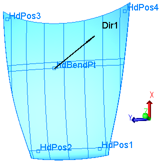

模拟柔性件装配弯折，不弯 CAD 只弯网格与点。定义 Bend Location（弯曲点）+ Bend Plane Direction（法向）→ 过弯曲点作平面，**只有平面正侧几何随之运动**；多平面取正侧交集。
> **复刻要点**：Move 统一抽象为「输入若干 (Object 点, Target 点, 方向) → 求 4×4 刚体变换」；引擎按列表顺序累乘。Bend 实现为对网格顶点逐点判定（在平面正侧则套用局部变换）。

### 4.1 Step Plane Move（台阶平面） · 
**用途**：主定位面彼此平行、次定位面彼此平行（可有台阶错位）时的 3-2-1 定位。**约束 6 DOF**（主面 3+次面 2+三面 1）。
**输入**：O1–O6 / T1–T6 + Dir1（主）/Dir2（次）/Dir3（三）。

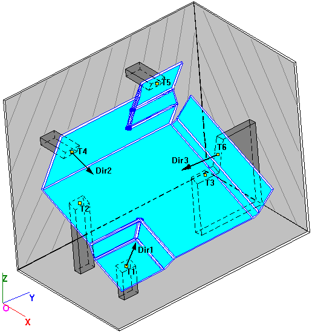

**算法**：① 3 主点贴到法向 Dir1 的平行 Target 面（锁 3 DOF）；② 2 次点贴到 Dir2 平行面（锁 2 DOF）；③ 1 三点贴到 Dir3 面（锁 1 DOF）。
**操作步骤**：点图标 → 选零件 → 拾取 6 组 O/T 点 → 给 Dir1/2/3 → 指定 Object/Target Plane 解释 → OK。

### 4.2 Six-Plane Move（六平面） · 
**用途**：最通用、最灵活，6 个点贴到 6 张**任意朝向**面，适合无规整基准面的零件。**约束 6 DOF**。
**输入**：O1–O6 / T1–T6 / Dir1–Dir6（每张面=1 点+1 法向）。

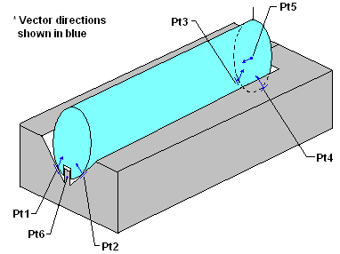

**算法**：求使各 Object 点落到对应 Target 平面的刚体变换（6 个点到面约束=6 标量方程，对 6 DOF 线性化迭代求解）。
**操作步骤**：点图标 → 选零件 → 拾取 6 组 O/T 点 → 逐个设法向 → 指定 Object/Target → 必要时进 Options 配 Bend/浮动 → OK。

### 4.3 Three Point Move（三点） · 
**用途**：经典 3-2-1，Object 平面对齐 Target 平面，约束 6 DOF。**输入**：O1/O2/O3、T1/T2/T3。

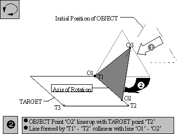

**算法（三步）**：① O1→T1（旋转支点）；② 绕 T1 转使 O1-O2 与 T1-T2 共线；③ 绕 O1-O2 轴转使 O3 落目标平面。闭式可解（平移+两次 Rodrigues 旋转），是其它移动的基础积木。

### 4.4 Two Point Move（两点） · 
**用途**：沿线/轴定位径向对称件，约束 5 DOF（绕轴自转不约束）。**输入**：O1/O2、T1/T2。
**算法**：① O1→T1；② 绕 T1 转使 O1-O2 与 T1-T2 共线（轴=O1O2×T1T2，角=夹角）。O1=O2 且 T1=T2 时退化为纯平移。

### 4.5 Best-Fit Move（最佳拟合） · 
**用途**：多对定位特征间按最小二乘最小化「距离平方和」求最优位姿，适合超定情形。

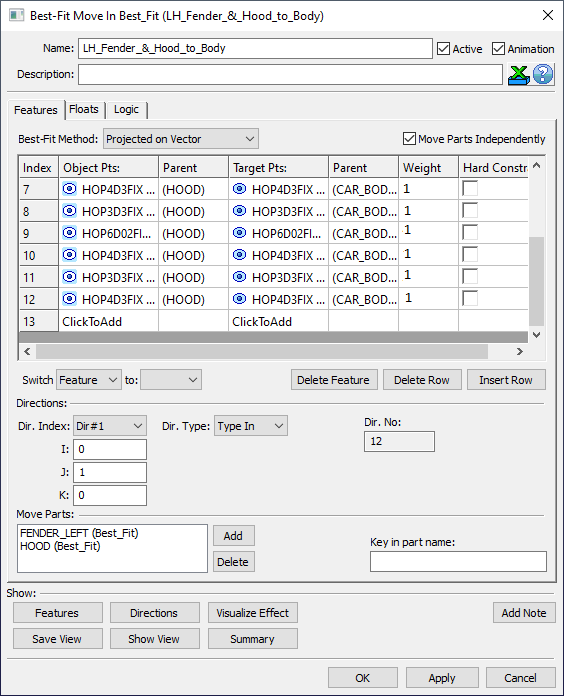

**每对约束方式**：Projected on Vector（仅沿向量）/ Projected on Plane（面内 2 平移+1 旋转）/ True Distance（6 向全约束）。
**参数**：Method、Weight(默认1，0=剔除)、Hard Constraint、Search Accuracy(默认 1.0e-05)、Max Iterations(500)。
**复刻要点**：无方向约束用 Kabsch/SVD 闭式；带方向/权重用 Levenberg-Marquardt 对 6 DOF 迭代。

### 4.6 Feature Move（特征移动） · 
**用途**：直接用特征定位，选特征时自动建点。按主/次/三三级逐级约束，未填满则部分约束。

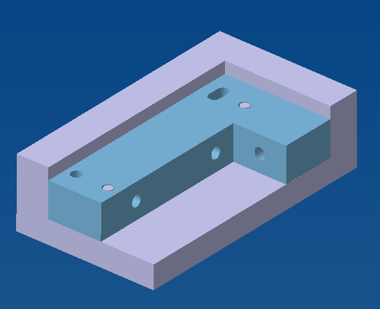

多特征定义一级时：几何中心取平均，方向取平均。Orientation Control：Mate / Flush。
**操作步骤**：点图标 → 选装配 → 从 Primary 起成对拾取 O/T 特征，再 Secondary/Tertiary → 选 Method → 必要时 Options 配 Condition/Iteration → OK。

### 4.7 Feature Move Cases（特征移动用例） · 
**用途**：枚举 Feature Move 内部对不同特征组合的定位判定。**归约规则**：共面非尺寸特征→LSQ 平面；共线尺寸特征/边→LSQ 轴。

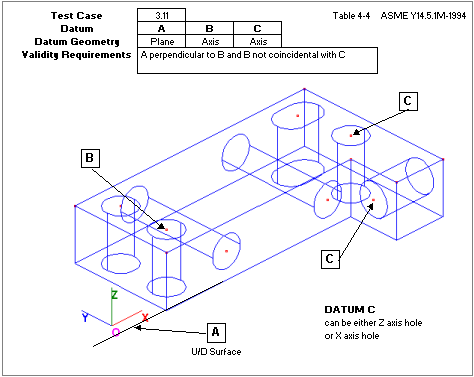

| Case | 组合 | 行为 |
|---|---|---|
| 207–214 | 轴-轴/轴-面 | 两不重合/平行轴定位 |
| 307–308 | 轴-面/面-轴 | 按夹角判垂直(45–90°)或平行 |
| 311 | 面+两轴 | 第一轴垂直于面 |
| 315–318 | 多平面 | 两/三张不平行面 |
| 361 | 面+两轴 | 带 DRF 的名义倾斜 |
| Tilting Primary Axis | 轴倾斜 | 带间隙轴插孔倾斜 |

**复刻要点**：建「(主,次,三特征类型)→求解策略」查表分派器，特征 LSQ 化后映射到点-面/轴对齐求解。

### 4.8 Pattern Rigid Move（成组刚性） · 
**用途**：用一组孔/槽/销作次/三向定位器装配刚性件。**只定位次/三向**，须先放定好主向的前置 Move。Object 特征数=Target 特征数（按序成对）。

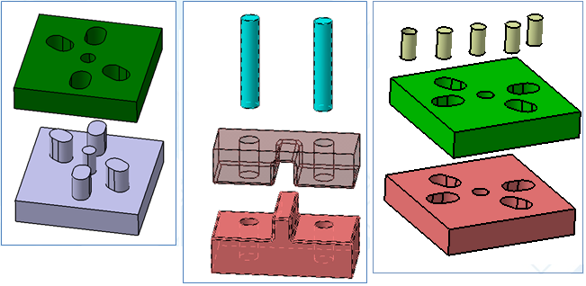

**四类**：Fixed-Fastener / Float-Fit-Fastener（最大化虚拟间隙）/ Float-Pin-Fastener / Float-Hole-Slot-Pin。
**参数**：Open Increment（逐步扩孔增量）、Iteration Number、Float Mode（Regular/1 Edge/2 Edge/Min-Max）。无解报 No-Build（查 Run Log）。

### 4.9 Pattern-Fit Move（成组拟合） · 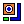
**用途**：把**多个零件**相对固定件及相互重新排布，靠孔/销组（Hole Sets）+ 点对约束（Constraint Pairs）。

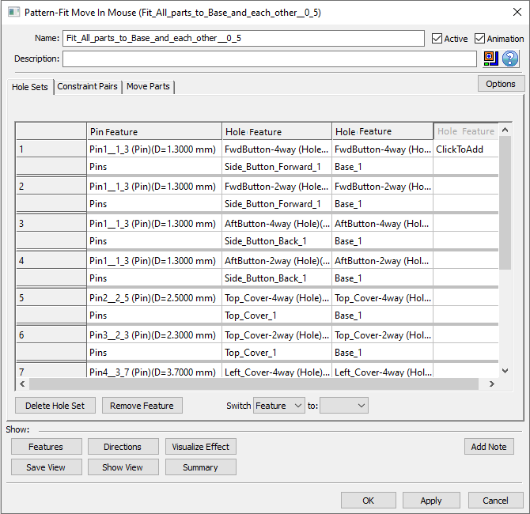

**算法**：校验孔组对齐 → 在 Upper/Lower Limit 内同时偏移各约束对 Object 点 → 迭代至满足或达上限（报 No Build）。只保证满足约束，不优化。
**复刻要点**：多体约束满足问题（CSP），迭代投影/松弛求可行位姿。

### 4.10 Match Move（匹配） · 
**用途**：旋转件转到使某点到目标几何距离=指定值，约束 1 旋转 DOF。**输入**：O1/O2(轴)/O3(动点)；T1–T5(T1-3 目标几何，T4-5 目标距离)。


**目标几何**：点(T1=T2=T3)/线(T2=T3)/面(互异)/接触(T4=T5,距离=0)。
**复刻要点**：单参数（转角 θ）求根——d(θ)=目标距离，二分/割线解 θ。

### 4.11 Iteration Move（迭代） · 
**用途**：绕中心点小步旋转/沿向小步平移/对一组 Move 套循环，直到某 Measurement 满足。常用于悬架/铰链/连杆。


**模式**：Translate / Rotate / Re-float(Loop，每次构建重随机浮动)。
**收敛**：Bisection（二分，稳）/ Bracketing Secant（割线，快但需括住根）。
**参数**：Mode、Center point、Direction、Initial Step、Iterations、Measurement(收敛判据)、Search Accuracy。

### 4.12 Transform Move（变换） · 
**用途**：把零件或点按指定量平移/旋转。**取值方式**：Constant / Random(分布+偏置) / Calculated(由 Measurement)。


**操作步骤**：选 Mode(Rotate/Translate) → 选对象(Parts/Points) → 选 Input 类型 → 设 Direction（旋转设中心）→ Nominal Build → Deviate 看结果。

### 4.13 Thermal Scaling Move（热缩放） · 
**用途**：按 CTE 与温差模拟线性膨胀/收缩。**公式**：`scale = 1 + alpha·delta_T`（alpha 默认 1e-5/°C，初温默认 20°C）。


**操作步骤**：[Add parts] 选件 → 填各件 CTE（或 Same CTE）→ 填温度（或 Same Temperature）→ 执行。
**复刻要点**：以 Scaling Point（默认首点）为中心 `p' = SP + scale·(p−SP)` 各向同性缩放。

### 4.14 User DLL Move（用户 DLL） · 
**用途**：把自编译 .dll 移动例程接入 3DCS。Generic 对话框按类别用标签页组织输入，参数取决于所选 User Routine。详见第 13 章。

### 4.15 Auto Bend（自动弯曲） · 
**用途**：处理主平面上**超约束**的零件。两模式：Auto Bend（自动选弯曲线）/ Segment Bend（手动）。


**两步**：① 前 6 对点定位（类 Six-Plane）；② 第 7+ 点作弯曲点变形特征，每段轴按点到线最近距离自动判定。

### 4.16 R-Touch Move（旋转触碰） · 
**用途**：绕轴旋转 Object，直到表面点以**最小角向距离**触到 Target 面。**输入**：方向向量(轴)、O1…On、T1…Tn+1(T1=旋转点)。
**算法**：① 算各 O/T 点夹角取最小角；② 绕轴（T1+方向）旋转该最小角。

### 4.17 Rotate Line Move（旋转线） · 
**用途**：绕轴旋转 Object 直到其上一条线与 Target 线平行。**输入**：Obj1/Obj2(对象线)、Tgt1/Tgt2(目标线)+Tgt3(旋转点)、方向向量(轴)。
**算法**：把对象线投影到垂直旋转轴的平面，绕轴转到与目标线投影平行。

### 4.18 Gravity Move（重力） · 
**用途**：模拟重力让孔/销沿重力向量自然下落安放。**输入**：O1…On(孔/销)、T1…Tn、方向向量(重力)。


**算法（三步）**：① 对象孔移到目标销建名义关系；② 各孔销对取**较小**间隙沿重力下落；③ 绕首接触对旋转到次对接触。不计重量，影响 GeoFactor 方程。

### 4.19 Least Squares Axis Move（最小二乘轴） · 
**用途**：**不移动零件，只移动点**（类公差例程，为 Virtual Clearance 测量而设）。两 Object 点作轴两端，对一组 Target 中心点求 LSQ 轴，再把两点移到轴与端面交点。
**复刻要点**：对中心点集 PCA/最小二乘直线拟合得轴向，求轴与端面交点定位端点。

### 4.20 Cross Product Move（叉乘） · 
**用途**：把两输入方向的叉乘 `Dx = D1×D2`（右手定则）作为一组点的关联方向。**输入**：≥1 个 Object 点、恰好 2 个屏幕方向。
**限制**：D1、D2 平行/反平行时输出零向量（需判退化）。

### 4.21 Line-Plane Move（线-面） · 
**用途**：用「线与平面交点」+ 平面上控制点把零件定位到平面。**输入**：O1/O2/O3(对象平面)、T1/T2(线)/T3(面上点)、方向向量(过 T3 法向)。


**算法（四步）**：① 求 T1-T2 线与平面交点 IntPt；② O1→IntPt；③ 绕 IntPt 转使 O2 对齐 IntPt-T3 线；④ 绕 IntPt-T3 轴转使 O3 落目标平面。先解线-面交点，其余三步与 Three-Point 同构。

---

## 第 5 章 · Tolerances 公差模块

公差是驱动 Monte Carlo 仿真的源头：告诉求解器某特征/点每次装配循环允许偏离名义多少、按什么分布偏离。三类公差源：GD&T（19 种）、3DCS Tolerance（点级）、共用的 Distribution，外加 Bonus/Datum Shift/Truncation 修饰与 Process Capability Database。

### 5.1 公差总论

#### GD&T vs 3DCS Tolerance
| 维度 | GD&T | 3DCS Tolerance |
|---|---|---|
| 作用对象 | 特征/特征点，整体语义 | DCS Point/Feature Point |
| 语义来源 | 工程图几何控制框(ASME/ISO) | 直接指定方向与幅值 |
| 几何效果 | 自动映射位置/方向/形状 | 用户指定方向向量 |
| 典型用途 | 复刻图纸标注、Datum、Bonus | 间隙/面差、CMM 回放、自定义 |

#### 公差→几何偏差映射（三种作用）
- **Location**：特征整体平移，形状方向保持完美（Position/Surface Profile 带 DRF/Concentricity）。
- **Orientation**：绕 Feature Locator Point 转，定位点零变化、边缘最大（Perpendicularity/Angularity/Parallelism）。
- **Form**：各节点/截面独立偏移（Flatness/Straightness/Circularity/无 DRF Profile）。仅 Form 类不需 DRF。

#### RSS 方法
同一特征叠加多个控制框时，用均方根叠加：调整各自 Range 使 **Location 与 Orientation 的 RSS 等于 Position 框总 Range**，两个正态分布叠加后仍正态且不越界。默认分布（1D Normal、2D RightSkew）是 RSS 正确运作的前提。

### 5.2 GD&T 定义流程与通用选项

#### 创建步骤
1. Model Creation 工具条点 GD&Ts 图标 ，选 Part/Assembly/Root。
2. 打开 GD&Ts 列表对话框。
3. 类型下拉选类型，点 **[Add]** 打开编辑对话框。
4. **OK**(保存关闭)/**Apply**(保存不关)/**Cancel**。
5. 用 Nominal Build + Deviate 核对偏差。


**主对话框参数**：Name(唯一)/Description/Active/Features/Type/Zone Shape(空/圆柱/球)/Range/Material Modifier(RFS/MMC /LMC )/Datum Reference Frame。

#### Options 选项卡


Link to DB、Distribution、Range/Offset、Rand Index、Range Scale、Min/Max Truncation、SigmaNum、Projected Tolerance Zone、Unit Basis、Calculation Method、Envelope On、Custom Direction、Group All Features、Feature Clocking、Auto Refine。

#### Datum Feature / Datum Target
类型选 Datum Feature → [Add] 拾取(Feature/Coordinate Point，**不允许** Feature Point/Dynamic Point) → 可选 Datum Targets → [OK] 自动分配 A/B/C。
- **平面型**：Z 坐标与向量都同→LSP；向量同向坐标不同→平均平面；非共面→平均平面。
- **轴线型**：LSA，支持 2/3/6 点（不支持 4 点）。

#### Datum Reference Frame（DRF）
点 **[Edit DRFs...]** → 选基准填 Primary/Secondary/Tertiary → 预览 → [Add]。


FoS 基准可加 MMB/LMB 修饰（触发 Datum Shift）；多基准可组 Common Datum（"A - B"）。

#### Composite GD&T（复合）
两个公差带：**PLTZF**(图样定位带，上框，Ran#1)与 **FRTZF**(特征关联带，下框，Ran#2)。特征先在 FRTZF 内独立变，再作为组在 PLTZF 内同步变。MMC/LMC 的 Bonus 在 FRTZF 层级生效。Feature Clocking（仅 Composite Position）把 PLTZF 分平移+旋转。

#### Unit Basis（变化率）
Form 类细化项（Flatness/Straightness/无 DRF Profile）。约束相邻节点协同变化，斜率=Zone Range÷Zone Size。矩形区 `√(L²+W²)`，直径区直接用 Zone Size。

### 5.3 GD&T 19 种类型

| # | 类型 (图标) | 控制 | 几何作用 | DRF |
|---|---|---|---|---|
| 1 | Size  | 尺寸 | 整体均匀缩放，位置/方向/形状不变 | 否 |
| 2 | Position  | 位置 | 整体平移 | 是 |
| 3 | Surface Profile  | 位置/形状 | 有 DRF→位置；无→形状(节点独立) | 可选 |
| 4 | Flatness  | 形状 | 各点独立偏移 | 否 |
| 5 | Perpendicularity  | 方向 | 绕定位点转 | 是 |
| 6 | Angularity  | 方向 | 绕定位点转 | 是 |
| 7 | Parallelism  | 方向 | 绕定位点转 | 是 |
| 8 | Straightness  | 形状 | diametrical→截面轴心独立；linear→各点独立 | 否 |
| 9 | Total Runout  | 位置/形状 | 圆柱→位置；平面→形状 | 是 |
| 10 | Circular Runout  | 位置/形状 | 同上(逐截面) | 是 |
| 11 | Circularity  | 形状 | 各截面尺寸独立、轴心共线 | 否 |
| 12 | Cylindricity  | 形状 | 整体圆柱度 | 否 |
| 13 | Concentricity  | 位置 | 轴心在直径带内偏移 | 是 |
| 14 | Symmetry  | 位置 | 绕中心面线性偏移 | 是 |
| 15 | Line Profile  | 位置/形状 | 有 DRF→位置；无→形状 | 可选 |
| 16 | Dimensioning Location  | 位置 | origin 作基准偏差传到 varying | origin |
| 17 | Angle Size  | 位置+方向 | 绕交点/小端旋转 | 选择顺序 |
| 18 | Torus Minor Diameter Size  | minor 直径 | 改截面厚度，major 不变 | 否 |
| 19 | (Set Feature Average) | 特殊功能 | 特征平均处理 | — |

> 3DCS 把 Position/Profile/Concentricity/Symmetry 简化为只控 Location；ASME 原义的方向/形状由独立 callout 用 RSS 组合。

**关键类型配图**：


### 5.4 3DCS Tolerances（点级公差）

直接作用于 DCS Point/Feature Point。**创建**：Model Creation 点 Tolerance 列表图标  → 选 Part → 选类型 [Add] → 编辑 → 核对。

**通用参数**：Name(唯一)/Active/Description/Features(括号显 Part)/Directions(Type In/Two Pt/Normal/AssocDir/PickPtDir)/Range(=Max−Min)/Offset(=(Max+Min)/2)/Distribution/Sigma Number(=(Max−Min)/6)/Range Scale。

**各类型**：

| 类型 (图标) | 用途 | 关键参数 |
|---|---|---|
| Linear  | 沿单一方向变化 | Distribution/Magnitude/Direction;模式 Individual/Group/Composite |
| Circular  | 垂直方向向量的平面内圆形区域变化(孔/销) | 两步:算径向幅值→旋到随机角;Rayleigh 径向+均匀角 |
| Size(Point-Based)  | 带 FoS 点的直径变化 | Mode(Independent/Group);不控 Envelope |
| Arc  | 沿圆弧路径偏移 | Center/Rand#1(半径)/Rand#2(角) |
| Capability  | CMM 实测数据回放 | Deviation/Position&Direction/Mean&Sigma/QDM Web |
| User DLL  | 自编 .dll 例程 | Generic 对话框分标签页 |
| Dual  | 两面共享点沿两方向(不必正交) | 2 Distribution/2 Magnitude/2 Direction |
| Triple  | 三面共享点沿三方向 | 3 Distribution/3 Magnitude/3 Direction |
| Radial Profile  | 共轴圆截面直特征 | range 作用于半径;中心默认(0,0,0) |


### 5.5 Distributions 分布

决定每次 build 在 Range 内如何抽样。默认 1D=Normal、2D=RightSkew。

**1D 分布（16 种）**：Normal  / Uniform  / Triangular  / BiMode  / Right Skew  / Left Skew  / OpenUp  / OpenDown  / User Defined(外部 .SMP) / Step(模拟均值漂移) / Constant / Weibull4 / Pearson4 / Modal / Trapezoid / Power Function。

**2D 分布（4 种，用于圆形/直径带，无 Offset）**：
| 分布 | 形状 |
|---|---|
| Normal-2D  | 双变量正态(默认配 RSS) |
| Uniform-2D  | "Hockey Puck"圆柱 |
| Triangular-2D  | 圆锥形 |
| Trapezoid-2D  | 截顶圆锥(单 B-Ratio 对称) |

> Rayleigh 是 Circular/2D-Normal 的内部径向抽样机制（x/y 双向正态合成）。

### 5.6 Bonus / Datum Shift / Truncation

**Bonus Tolerance**：控制框带 MMC/LMC 时 FoS 尺寸提供额外公差。支持 Position/Flatness/Perpendicularity/Angularity/Parallelism/Straightness/Circular。
四步：①按 size 变尺寸 → ②`Bonus=|实际−MMC/LMC|` → ③加到 Range → ④用扩展 Range 偏差。须配 Size GD&T。


**Datum Shift**：零件在检具定位时的可用装配间隙。基准带 MMC/MMB 时，未达 MMB 的零件可在检具上轻微平移使被测特征更近名义、变化减小。

**Truncation**：剔除范围外数据。参数 Max/Min Truncation。对几何公差会改变直方图形态（Normal 截后变 Pearson I）。

### 5.7 Process Capability Database（PCDB）

制造工艺与公差数据集中库，"改一处同步所有链接公差"。Excel(CSV) 格式。


**创建**：[Create Default DB File] → 选位置 → [Edit Database File] 开 Excel → 改/删行。
**记录结构**：过滤器（MATL_TYPE/PROC_TYPE/FEAT_TYPE/DB_DELIMITER/DB_Version）+ 公差定义列（Tolerance Name/RAND_NUM/+/-3STD_Value/OFFSET_VALUE/TYPE_NAME/SIGMA_NUM/SKEW/KURT/SETTING_TYPE）。Position/Composite 需 2~4 行（Rand#1~#4）。

---

## 第 6 章 · Measures 测量模块

测量是连接「模型+公差」与「统计结果」的桥梁：把每次 Monte Carlo build 的几何状态压缩成一个可做直方图/Cpk/贡献度的标量。复刻建议把测量层设计成独立求值引擎——输入当前 build 所有点/特征实际坐标，输出 double（外加 USL/LSL 判定）。

### 6.1 测量总论与通用参数

#### 6.1.1 本质与复刻抽象
每个 Measure 持有若干几何引用（点、特征、或对其它测量的引用），实现一个 `evaluate(build) -> double` 方法。引擎在每次 build 循环结束后对所有 Active 测量逐个求值，存入样本表；N 次 build 后得到该测量的样本分布。USL/LSL 仅用于事后统计判定，不参与几何计算。

> **复刻要点**：测量层 = 独立求值引擎。数据结构含「绑定装配节点 + 输入引用(点/特征 ID) + Direction Mode + Spec(USL/LSL/Mode) + Active/Output flag」。每个测量保存 nominal 基准值（Nominal Build 时刷新）与每 build 的 current 值，偏差/有符号结果以两者之差定义。


#### 6.1.2 通用参数表

| 参数 (EN/中文) | 说明 | 范围/枚举 | 默认 |
|---|---|---|---|
| Name 名称 | 唯一标识 | 禁用 `\ / : * ? " < > \|`；点和空格自动转 `_` | 无 |
| Measure Active 激活 | 勾选才参与求值；关掉则该 build 跳过但保留在列表 | bool | active |
| As Output 作为输出 | 是否出直方图（Combination 子项可隐藏但保持 active） | bool | 输出 |
| Description 描述 | 说明（逗号会致 CSV 导出错列） | 文本 | 空 |
| Direction Type | 方向来源 | Type In / Two Points / Normal / AssocDir / PickPtDir | — |
| Direction Mode | 测量如何用方向（决定真实距离/角度 vs 投影） | 各类型枚举不同 | 因类型而异 |
| Upper Spec. USL | 上规格限，直方图画线 | 可启/停（停=N/A） | N/A |
| Lower Spec. LSL | 下规格限 | 同上 | N/A |
| Specification Mode | USL/LSL 解释方式 | Absolute(绝对) / Relative to nominal(相对名义) | — |
| Scale 比例 | 测量值乘法系数 | 实数 | 1 |
| Related List | 关联已定义关联列表 | 下拉 | 无 |

#### 6.1.3 方向模式（贯穿全章的关键概念）
- **True Distance / True Angle**：两几何体最短距离/夹角，结果**非负，不需方向向量**。
- **Projected on Vector**：距离向量点乘指定方向向量，结果**可正可负**（偏移方向与向量相反时为负）。
- **Projected on Plane**：先投影到由方向向量定义的观察平面，再在面内量距离/角度，结果**非负**。

> Spec Mode 的 Absolute/Relative 与测量值符号正交，分开建模。例：名义 10 → Absolute 为 8.5–11.5；Relative 为 ±1.5。
> 多模式提示：True/Projected-on-Plane 可能致 Contributor/GeoFactor 不准。

#### 6.1.4 管理操作与通用步骤
**6 种管理操作**：Create [Add] / Edit [Modify] / Copy(同跨装配) / Delete(Ctrl 多选) / Convert(类型转换) / Reorder(下拉+箭头，影响装配阶段语义)。
**通用步骤**：① 点目标类型图标新建 → ② 在 3D 视图/模型树依次拾取所需点/特征 → ③ 选 Direction 来源与 Direction Mode → ④ 填 USL/LSL 并设 Spec Mode → ⑤ **Nominal Build** 刷新 Measure Current 值，确认与设计意图一致 → ⑥ 命名保存。
> 几乎所有测量页提示：执行 Nominal Build 刷新 Current 值，否则 Contributor/GeoFactor 失真。

### 6.2 Point Distance 点距离 · 
最通用测量，4 子模式，可用点或特征，方向向量可定制。

**(a) Nominal-Point**（1 点）：量点相对其 nominal 位置的偏移。
- True Distance：`|P − P₀|`（非负，无向量）。
- Projected on Vector：`(P − P₀) · d̂`（点积，可负）。
- Projected on Plane：垂直 d 平面上真实距离（非负）。
- 场景：单点定位偏差、CMM 单点对名义。

  

**(b) Point-Point**（2 点）：量两点间距离。True=`|P₂−P₁|`；Projected on Vector=`(P₂−P₁)·d̂`（P₁→P₂ 与 d 同向为正）。场景：间隙(gap)/面差(flush)/中心距。

 

**(c) Point-Line**（3 点=1 测+2 定线）：True=点到线垂距 `|(P−A)−((P−A)·û)û|`（非负）；Projected on Plane 需 2 向量（Dir#1 定测量向量，Dir#2 与线定投影平面）。


**(d) Point-Plane**（4 点=1 测+3 定面）：True=`|(P−Q)·n̂|`（非负）；Projected Along Vector 当点到面向量与 d 反向时为负。场景：面差/贴合。

 

### 6.3 Dimensional Distance / Circle 类

**Dimensional Distance** ：测两 CAD 特征间距（计入公差），类似 CAD 测量。
- 模式：Center Distance(几何中心距) / Minimum Distance(最短距) / Maximum Distance(最远距)。
- 支持特征：平面/圆柱/球/槽-Tab、Feature Points、Coordinate Points（面-面/面-柱/柱-柱/球-球等）。
- 方向：Auto(默认,取第一特征,受朝向公差影响)/Constant(固定不受公差)/Custom(拾取特征定方向)。
- **Spec Limits 必填**。选取法：直接选 CAD 面，或 Point at Click 在点击处建点。


**Circle Interference** ：测一组或多组孔/销装配的间隙/干涉，识别装不上的配置。
- 输入：中心点+柱面（holes/pins/slots/tabs），分 Objects 与 Targets 两组，须按设计一一对应且顺序一致。
- 输出模式：Min Clearance(所有装配最小间隙的最小值)/Max Clearance/Interference(干涉计数概率分布)。
- 符号：**负值=干涉**（如 −2.33 表示撞车），正值=间隙。Spec Mode=Absolute，推荐 LSL=0,USL=N/A。
- 限制：Contributor/equation 可能不准，建议导出原始数据到电子表格分析。


**Virtual Clearance** ：求能穿过一组孔的最大螺栓 / 套在一组销外的最小管径。
- 输入：≥2 个带圆 size 公差的坐标点（孔或销），或 feature points 作 FoS，**必须有方向向量**（可用 pin/hole 关联方向）。
- 模式：Auto(按输入自动选)/Inner Diameter(输出最大销径)/Outer Diameter(输出最小管径)。
- 输出 Min/Max/Range；负值=各直径需增大才重叠的最小量。Spec Mode=Absolute(Hole→最大值入 USL,Pin→最小值入 LSL)。

 

**Circle Diameter** ：计算圆/槽直径(size 变差)。1 个带圆/槽的点，Direction Mode 与 Direction 均为 None。**不支持 Contributor 与 GeoFactor**。

**Circularity** ：评估一组点对圆形的符合度（两同心圆间的圆度带）。
- 输入：≥4 个名义共半径的点；**方向向量必填，须垂直于圆面**。
- 数学：把点投影到垂直方向向量的平面 → 外圆=含所有点的最小外接圆；内圆=所有点都在其外的最大同心内切圆；**圆度=外圆半径−内圆半径**。


### 6.4 Feature 类

**Feature Measure** ：检查相对名义偏差，报两组特征间最小间隙或干涉。
- 数学(mesh-based)：计算每个曲面与每个 **Mesh Node**（网格节点）间距离，取最小。
- 模式：Feature-Feature(From/To 列表各面间报最小/干涉)/Feature-Nominal(沿向量报相对名义最小偏差)/Feature-Self(名义曲面每点到偏差后曲面对应点,沿法向)。
- 条件：Contact Condition(名义接触报0)/Offset Condition(用曲面方向定义最小距离)/Interference Condition(报负值,受 mesh 密度影响)。
- 许可：Basic 无需额外 license；**Enhanced 需 Mechanical License**(更精确算法+精确干涉模式)。

 

**Feature Angle** ：输出两特征夹角的名义值与变差。
- 数学：角度由两特征向量的**叉积按右手定则**计算。方向计算依名义角范围有规则(90°~−90° 用 ±180° 偏移;270°~90° 用 ±360°/0°)。
- 输入：CAD 曲面(planes/cylinders/slots/tabs)；2 特征；方向 Auto(默认,用叉积)/Custom Direction。**不推荐 spheres 和 edges**。
- USL/LSL 以**度**表示(推荐填)；Spec Limit Relative 默认开启。


### 6.5 Line Angle / Plane Angle
线角 ，面角 。通用：True Angle 无方向向量；Projected on Plane 需向量，"沿指定方向观察"，当方向向量与两线/面向量(或其叉积)夹角 >90° 时为负。

| 子类型 | 输入 | True Angle 范围 | Projected on Plane |
|---|---|---|---|
| Line-Nominal | 2 点 | 0–180° | −180~+180° |
| Line-Line | 4 点(两条线) | 0–180° | −180~+180° |
| Line-Plane | 5 点(2 定线+3 定面) | 0–90°(线与面最小夹角) | 投影后求角 |
| Plane-Nominal | 1 面(3 点) | 0~+180° | −180~+180° |
| Plane-Plane | 2 面(6 点) | 0~+180° | −180~+180° |

 

### 6.6 Two Point List / Combination / Equation / User-DLL

**Two Point List** ：测一组点 {Pa₁…Paₙ} 与另一组 {Pb₁…Pbₘ} 间距离（同/异零件均可）。
- Direction Mode：True Distance / Projected along Vector。
- 6 种 Measure Type：All Points Min/Max(两两组合)；Pair Points Min/Max(同索引配对 Group1[i]-Group2[i])；Pair Points Max-Min(配对极差)；Center Deviate(配对中点对名义点积,算指定方向变差)。

 

**Combination** ：对已定义 active 测量做运算，无几何无方向，来源 "Adding List" 下拉。
- Add(默认)=`Σmᵢ` / Subtract / Max Value=`max(mᵢ)` / Min Value=`min(mᵢ)` / In-Spec=`(ΣI(mᵢ))/N`(合格率，I=1 若在限内)。
- In-Spec 需 Spec Mode=Absolute。配 As Output 隐藏子测量只出组合结果。


**Equation** ：不写 DLL 创建高级方程测量，输出单一标量（单位取 Model Settings）。
- 四 Tab：Features(向 Group1/Group2 加点作变量)/Equations(写公式)/Measures(引用其它 active 测量)/Values(常量)。
- 变量语法 `[Keyword:Index]`。关键字：`MS`(测量值)、`P1X/Y/Z` `P2X/Y/Z`(点坐标)、`P1C/P2C`(半径)、`P1I/J/K`(方向)、`STR`(前方程结果)、`VAL`(常量)、`SETCFG`(输出单位)。
- 运算符：基础 `+ − / * ^ sqrt sin cos tan abs log round`；高级 `arcsin arccos arctan deg2rad rad2deg mm2inch inch2mm MIN MAX`；条件 `if_then_else`(`== < > <= >=`)。
- 约束：每方程 ≤**400 字符**；变量大写加方括号；负数加括号 `(-1)`；小数用点；注释 `rem` 开头。


**User-DLL** ：挂接自编译 .dll 测量例程（详见第 13 章）。Generic 对话框加载例程，输入按类型分 Tab。

### 6.7 GD&T Measure（6 种）
按 GD&T 标准评估特征相对 **DRF（Datum Reference Frame）** 的变差，多特征报 Recommended GD&T Value 最大者。
对话框结构：Common Parameters Tab(Feature List/Measure Type/Zone Type{diametrical/non-diametrical}/DRF 下拉/From Nominal/USL-LSL) + Edit DRFs Section + Options Tab(non-diametrical 时 Custom Direction)。

> **复刻关键**：所有 GD&T 测量内部都分解为若干 **Point Distance**，报 Recommended GD&T Value 最大者。**不支持 MMC/LMC/datum shift**（与真实 GD&T 标准的关键差异）；结果允许为负以维持线性。


| 类型 | 内部实现（降解为 Point Distance） |
|---|---|
| Position  | Diametrical:0/45/90/135° 4 个 Point Distance 取最大;Non-Diametrical:沿 Reference Point 方向 1 个 |
| Surface Profile  | 单点=RP 与测量点 Point Distance(每 build 用 DRF 重算 RP);单特征无 FP 取曲面 3 内部极值点;多点逐个取最大 |
| Perpendicularity  | Diametrical:**8 个**(2 轴端点×4 方向)相对 Feature Locator Point(FLP);Non-Diametrical:平面 3 极值点回 FLP。名义须垂直 DRF,不支持单点 |
| Angularity  | 同 Perpendicularity(共用例程),只看角度偏差 |
| Parallelism  | 同上(diametrical 8 个;non-diametrical 3 极值点回 FLP) |
| Concentricity  | 4 方向(0/45/90/135°)内部 Point Distance:单点 4 个,多点/轴特征 8/12/16 个,报最大。名义须同轴 DRF |

> Perp/Angularity/Parallelism 三者共用同一测量例程，差异仅在 DRF 与名义朝向约束的语义。

### 6.8 Related List / Measurement Generator / Model Variants

**Related List** ：把多个点和测量关联到一个 Related List 名下，绑到某主测量同屏查看相依分布。
- Edit Related List 对话框两区：Related List 区(Add/Delete/Rename/Summary) + Measures List 区(增删测量、管理关联点)。
- 集成：测量对话框右下角的 Related List 下拉。
- 查看：仿真后右键 "Show Related" 以 HTML 显示 Nominal/Maximum/Minimum Position 数据。


**Measurement Generator** ：用多个点快速批量创建测量。
- 仅支持 **Point-Nominal** 与 **Point to Point**。
- 特征选取：Select Part(整零件所有点)/Select Feature(单点)；Only Tol or Move Pts 过滤未用特征。
- 字段：Directions(X/Y/Z/Diameter/Associated Vector)、Upper/Lower Spec Limits、Prefix、Description、Create Measures in。
- 命名：用于 CMMDev/DCSDB2 时线性测量带 `_X _Y _Z` 后缀、直径带 `_D`。
- 工作流：特征加入 Feature List → 生成进 Measure List → **必须 Apply 才创建**。

**Model Variants** ：创建 Moves/Tolerances/Measures 的变体，激活或在多场景间切换。
- Measure 是三类可纳入变体的组件之一，可选择性加入特定测量或全部。
- 访问：Model Creation 工具栏，或在单个 MTM 上右键。
- 对话框命令：增删组件、Apply/Copy/Delete 变体表、更新激活状态、CSV 导入/导出、生成 Summary、运行 **DoE（试验设计）**。


---

### 6.9 测量类型选型对照表（复刻速查）

| 测量类型 | 输入 | 输出/单位 | 可负? | Direction 必需? | 典型场景 |
|---|---|---|---|---|---|
| Nominal-Point | 1 点 | 距离 | Proj 可负 | 仅投影 | 单点定位偏差 |
| Point-Point | 2 点 | 距离 | Proj 可负 | 仅投影 | gap/flush/中心距 |
| Point-Line | 3 点 | 距离 | 否 | Proj on Plane 需 2 向量 | 点到边距 |
| Point-Plane | 4 点 | 距离 | Proj 可负 | 仅投影 | 面差/贴合 |
| Dimensional Distance | 2 特征 | Center/Min/Max | 视方向 | Auto/Constant/Custom | CAD 式特征间距 |
| Circle Interference | 孔销中心+柱面,两组 | Min/Max Clearance,干涉计数 | 是(负=干涉) | 否 | 孔销可装配性 |
| Virtual Clearance | ≥2 带 size 公差点 | 最大销径/最小管径 | 负=需增大量 | **必需** | 螺栓穿孔群 |
| Feature Measure | 1+ 特征(mesh) | 最小间隙/干涉 | 是 | 视条件 | 面间隙/干涉 |
| Feature Angle | 2 特征 | 角度/度 | 视方向 | Auto/Custom | 特征夹角 |
| Line/Plane Angle | 2/4/5 点或 1/2 面 | 角度 | Proj 可负 | 仅投影 | 线/面朝向夹角 |
| Two Point List | 2 组点 | 距离(6 聚合) | 视方向 | Projected | 多点群间距 |
| Circle Diameter | 1 带圆/槽点 | 直径 | 否 | None | 孔/槽尺寸变差 |
| Circularity | ≥4 共半径点 | 外R−内R | 否 | **必需(法向)** | 圆度带 |
| Combination | 引用其它测量 | 和/差/min/max/合格率 | 视操作 | 否 | 叠加堆栈/In-Spec 率 |
| Equation | 点+测量+常量 | 单一标量 | 公式定 | 公式定 | 任意自定义量 |
| GD&T(6 种) | 特征/点+DRF | Recommended GD&T Value | 否 | DRF 导出 | 位置度/轮廓/朝向 |
| User-DLL | 例程定义 | 例程定义 | — | — | 自定义算法 |

---

## 第 7 章 · 统计分析与仿真引擎

把零件公差、装配定位、浮动间隙等"输入变差"通过几何模型传播到关键测量，定量预测装配统计表现。

### 7.1 三种分析方法对比
- **Monte Carlo**：反复施加随机变差，累积直方图。唯一能处理**非线性**，分布支持最全，工业最认可，但改公差要重跑、样本大耗时。
- **Contributor (HLM)**：每次只把一个公差推到 High/Low/Median，其余名义，测影响反推占比。
- **GeoFactor 方程法**：由 HLM 灵敏度用解析公式（RSS/Worst Case）直接算统计量，无需抽样。

**HLM/GeoFactor 七条假设**（Monte Carlo 不受约束）：测量是公差线性函数、各输入独立、单公差变其余名义、圆形/位置类近似正态、尺寸按 MMC/LMC 折算 bonus、各方差可叠加、足够多独立项叠加趋正态。

| 维度 | Monte Carlo | Contributor | GeoFactor |
|---|---|---|---|
| 非线性 | 支持 | 仅线性/近似 | 仅线性 |
| 贡献度排序 | 否 | 是 | 是 |
| 公差变更后 | 重跑 | 重跑 | 重算 |
| 耗时 | 较长 | 较短 | 最短 |

### 7.2 Run Analysis 运行分析 · 
**前置校验**：Scale=1、Nominal Build 位置、无 validation 报错。


| 参数 | 说明 |
|---|---|
| Monte Carlo Analysis | 勾选执行；Total Runs（常用 5000–20000） |
| HST/HLM File | MC 结果存 *.hst，Contributor 存 *.hlm |
| Contributor Analysis | 勾选执行 HLM，可附 GeoFactor |
| Initial Seed | 同 seed+同轮数→完全可复现 |
| Threads | 0–8 并行 |

**仿真应用顺序**：先 Tolerances → 再 Moves → 最后 Measurements；从装配树最内层向外推进。Move 应放在被移动件**上一层级**。

### 7.3 Monte Carlo 输出统计量
直方图横轴测量值区间、纵轴频数，USL/LSL 参考线（可拖动）。


| 统计量 | 公式/说明 |
|---|---|
| Mean μ | `(1/N)Σxi` |
| Std Dev σ | `√[(1/N)Σ(xi−μ)²]`（用 /N 总体方差） |
| 6-Sigma | σ×sigma number（默认 6） |
| Skewness | `(1/N)Σ((xi−μ)/σ)³` |
| Kurtosis | 尾部厚度，正态基准 3 |
| Cp/Pp | `(USL−LSL)/(6σ)` |
| Cpk/Ppk | `min((USL−μ)/3σ, (μ−LSL)/3σ)` |
| L-OUT%/H-OUT%/Tot-OUT% | 超差比例 |
| DPMO | 每百万缺陷，目标 3.4 |

**非正态拟合**：从 Constant/Min-Max/Pearson I/III/IV/V/VI 选最佳，给 Estimated Pp/Ppk。
**Recommended GD&T** = 最大绝对偏差(±3σ)×2，计入均值漂移。
**收敛**：以标准差为判据。Percent Error{1/3/5/10%} × Confidence{80–99%}。默认 3%@95% 需 **2137** 轮，1%@99% 需 **33178** 轮。


**置信区间**（围绕超差比例）：`p=超差数/总数, q=1−p, σ=√(pq/n)`，乘子 90%→1.645/95%→1.960/99%→2.326。
**重复性**：同轮数+同 seed 可复现；公差应用顺序/点数/float 设置/创建顺序不同会带来差异。

### 7.4 GeoFactor 方程法
**G Factor** = 贡献者作用于测量的标量倍数。|GF|<1 衰减，|GF|>1 放大。
核心关系：`σ_i × G_i × 6 = Effective 6-Sigma_i`；测量总 `6σ = √(Σ(σ_i·G_i·6)²)`。


**Worst Case**：`Range×GeoFactor=Contributor WC Range`，`Σ(Contributor WC Range)=Measure WC Range`（算术和，比 RSS 宽）。三种例外（MMC/LMC bonus 不对称）需分别做 max/min 两次。
**线性度**：`Measure=c1·tol+c2`。公差相对零件尺寸很小时多数测量"事实上线性"。判定：比对 GeoFactor 与 Simulation 结果是否吻合，或缩放公差看结果是否同比例。

### 7.5 Contributor 贡献度
**HLM 算法**：所有输入置名义 → 每次只偏动一个贡献者(High/Low/Median)测影响 → 求总变差 → 按比例换算百分比。
**贡献百分比**：`Contribution_i% = (σ_i·G_i)² / Σ(σ_j·G_j)² × 100%`（方差占比）。


输出列：测量名/Index/贡献者名(前缀 HP=孔销浮动,SP=销槽浮动)/系数/范围(M 量值/C 间隙/A 角度)/GeoFactor/6-Sigma/百分比。
显示模式 Per Tolerance(RSS 合并)/Per Feature。存 *.hlm(可再导入)或 *.rss(Excel)。

### 7.6 Simulation Window / Show Graph / Show Samples
跑完弹出 Simulation Window，三菜单：File(加载/保存 HST/HLM、切 variant)、View(显示测量/Show Graph/贡献者/Show Samples)、Analysis(Summary/Settings/Pp 调整)。Analysis Table 并排 MC+GeoFactor+Contributor。
- **Show Graph**：把模型摆到指定统计位置(Max/Min/±1~5σ/Mean)直观查看。
  
- **Show Samples**：拖直方图 SMP 条选单个 build，看各测量值、Show In GraphView/Hist View。

### 7.7 Batch Processor 批处理 · 
后台分析工具，**不需几何即可建模运行**。核心 **`dcsSimuMacro.exe`**（DOS 可执行，依赖 Analysis Engine）。
两控制文件：Script `dcsSimuMacroScript.txt`(逐步指令)+Batch `.bat`(启动+license 路径)。路径无空格，单行≤399 字符。

**关键字**：`DCSVERS`(版本)/`DCSWORK`(工作目录)/`DCSLOAD`(加载模型)/`DCSSIMU`(seed,轮数,结果)/`DCSSIMU_SAVE`/`DCSSENS`(Contributor)/`DCSGEOF`(GeoFactor)/`DCS_SBS_RUN`(SBS)/`DCSRUNDOE1`(DOE)/`DCS_TREND_STUDY`(趋势)/`DCSREPORT_GEN`(报告)/`DCS_CFG_SETTING`(线程)/`DCSPAUSE`。
**返回码**：0 成功 / -1 命令错 / -2 缺主 license / -3 缺 add-on / -4 无工作目录。

---

## 第 8 章 · 图形分析与报告输出

### 8.1 图形分析总论与装配状态机
两阶段：**Preliminary**（预检，不跑公差，验证 Move 与装配顺序）/ **Statistical**（统计，引入随机变差）。

**五个核心动作语义区别**（最易实现错）：

| 动作 | 重置点到 nominal | 执行 Move | 施加公差 | 用途 |
|---|:---:|:---:|:---:|---|
| Nominal Build | 是 | 是 | 否(连 Constant/User DLL 都不跑) | 建立基准装配 |
| Assemble | 否(保留偏差) | 是 | 否 | 在已 Deviate 结果上继续装配 |
| Separate | —(拆开) | 撤销 | 否 | 撤销 Animate/Build/Assemble |
| Deviate | 视状态 | 是 | 是 | 逐次随机变差 |
| Sweep | 同 Deviate | 是 | 是(保留轨迹) | 同 Deviate 但叠加残影 |

```
                 Nominal Build (reset + move)
   [Separated] ───────────────────────────────▶ [Nominally Built]
        ▲                                              │ Assemble (no reset)
        │ Separate                                     ▼
        └────────── Separate ──────────── [Assembled / Deviated]
                       Deviate/Sweep (loop) ──────────┘
```

### 8.2 装配与偏差可视化
- **Nominal Build**：点位归零→一步装配，绝不跑公差。
- **Assemble**：执行 Move 但保留偏差。
- **Separate**：拆回。
- **Animate**：逐 Move 播放。控件 One Step/Step Part/Step All/Pause。
  
- **Deviate**：图形化变差。Run At/总步数 100000/Delay 0–20/Hold/Cancel。
- **Deviation Control**：Continuous(连续)/One Step(每按 Start 一个 build，可填 Init Index 或 Seed，Restart 生效)。
  
- **Sweep**：保留残影看变差包络。
- **Deviate To Offset**：把带 offset 公差的 feature 移到偏移位置（mean shift 模型）。
  
- **Visualize Effect**：单输入变到 high/median/low 看贡献。Profile/Linear 变 2 位置；Position/Circular 绕圆 6 位置；Float 需 Nominal Build 态。
  

### 8.3 Color Contour 变差云图
**着色算法**：变差最大→红（正向偏差），最小→蓝（负向），中间光谱过渡。前提：≥1 公差/GD&T、1 Move、1 测量。**贴 material 会遮挡，须先隐藏**。
三类开关：Shading(表面着色)/Lines(测量统计线)/Options(配置)。


**Setup（Multi-CAD）**：右键顶层装配→Part and HSF Color Settings→Set all to HSF Surfaces and 3DCS Lines→Color Contour Flags 勾选零件。


**步骤**：激活 Shading → Nominal Build(全蓝+Legend) → Deviate(偏差着色)。
**Legend**：Show/Precision/Manual Scale(默认 0–100)/Position(双滑块)/Font Size/Color Boxes。
**Lines**：在测量位置画统计线(% out of spec/N-STD/Ppk/estimated range)，线宽 1–10。


### 8.4 Report Generation 报告输出
让无 3DCS 环境也能分享结果。格式由 Preference→External Application 决定（Office vs Google）。

**Views/MTM Views**：每个 MTM 关联保存视图（Save View/Show View），用于报告配图。
**Report Pages**：Cover Image/Cover Page/Model Summary(Word 模板)/Part Notes/Analysis Page/Tolerance Page。图像默认 600×400。Analysis 页支持排序/过滤/条件格式(target→黄/绿，marginal→红/黄)。


**五种报告**：
| 报告 | 关键 |
|---|---|
| **HTML** | 浏览器可读，含 Measure min/max/nominal 动画 |
| **Spreadsheet(Excel)** | 输入输出带链接，分选项卡 |
| **PowerPoint** | 模板 `dcstemplate.ppt`(路径 `AppData\Local\DCS\DCS_V5`)，须保持原名原位 |
| **Google Workspace** | 设 External App=Google→授权 Allow→存 Drive "3DCS Files"，需 2 分钟 |
| **APQP** | Excel；Process Flow Diagram(装配序列)+DFMEA(SP/PC/CC/SC) |


### 8.5 Spec Study 与 Gap & Flush
**Spec Study**：无需物理样件评估尺寸目标，≥2 测量。三求解法：Rigid(刚体)/Influence Sphere(影响球缩放，角度>95° 报错)/Compliant(FE 柔性)。Spec Item Type：Nominal/USL/LSL/Specified。可导出极限位置为 CGR/CAD。


**Gap & Flush**：交互式切剖切平面+建带方向测量点。方向 Pt1 Dir U/Pt2 Dir U/Pt-to-Pt2 Dir U，面方向可 Reverse。创建后作普通 measurement。


---

## 第 9 章 · AAO 高级分析与优化器

AAO（Advanced Analyzer and Optimizer）是独立授权模块，把已搭好的 3DCS 模型转成「方程系统」：贡献项(公差)为**输入**、测量为**输出**、影响系数(GeoFactor)连接两者。与基础统计的区别：基础是「正向」(给公差跑分布)；AAO 是「方程化+可反推」(What-If 改公差无需重跑，并驱动优化器寻优)。


**7 个工具**：GeoFactor Analyzer(矩阵呈现)/SBS(仿真灵敏度含交互)/CTI(跨测量排名)/LSA(评估 move 稳健性)/TO(成本优化)/SO(序列优化)/DO(基准优化)。

**典型链路**：搭好模型并跑仿真 → 用 GeoFactor 矩阵/SBS 看清变差来源与系数 → 用 CTI 在多测量维度锁定关键公差 → 用 TO 做成本优化、SO/DO 做工艺/基准寻优 → 用 LSA 验证定位稳健性 → 导出/导入矩阵复用。

### 9.1 Simulation Based Sensitivity (SBS)
用**完整仿真**（数百到数千样本）度量每公差真实影响，能捕捉**非线性与交互**——这是与线性 GeoFactor 的关键差别。输出三类：方差贡献、均值漂移贡献、几何系数。
**判定准则**：Coefficients 只在「线性+无交互+全正态」时等于 GeoFactor 值，否则不同。

**系数提取（coef = y/x）**：把某贡献者范围设为 `x`、其余所有压到 **0.000001**（相当于关掉，但保留随机数流一致），仿真读测量 n-STD 为 `y`，则 `coefficient = y / x`。
**交互项提取（degree=2）**：`Interaction(A,B) = 两项都开 − 只开A − 只开B`（常为负，表互相放大）。高阶交互从「集合全开」扣除所有子集效应分离；行数 = `Σ_{k=1..D} C(N,k)`（N=4,D=4 → 15 行）。
**数值算例**（两点各 1.00mm 线性公差，方向 (0,0,1)，25000 次）：独立预期 RSS=`√(1.006²+1.002²)≈1.420mm`；实测全开 `2.005mm`；交互系数=`√(2.005²−1.006²−1.002²)≈1.416mm`（矩阵显示 1.415）→ 互相放大而非简单叠加。
**Offset 处理**：改范围时保持形态——等量双边(±0.5→±0.75)、单向(+1/-0→+1.5/-0)、零范围(+1/+1，关时+0/+0、放大时+1.5/+1.5)。

**参数**：

| 参数 | 范围/默认 | 说明 |
|---|---|---|
| Degree of Interaction | 1–6，默认 2 | 同时评估的并发贡献项数 |
| Simulation Trials | 用户定义(如 25000) | 每个 trial 的样本数 |
| Threads | 0–8 | 计算线程 |
| Trials 总数 | 贡献项数 +1 | 每个 trial 一种开关组合 |

**局限**：能预测 Mean 和 n-STD，**不能**预测曲线类型(Curve Type)和估计范围(Estimated Range)；大模型/高阶交互慢；把分布类型/scale 全纳入系数；out-of-grouped 公差当单个贡献项(GeoFactor 当分开)。
**操作步骤**：① 打开含公差/move/measure 的模型并跑仿真 → ② 菜单启动 SBS → ③ 设 Degree/Trials/Threads → ④ 运行查看方差/均值漂移/系数矩阵 → ⑤ 改范围观察系数驱动的结果变化。


### 9.2 GeoFactor Analyzer Matrix
关系式 `Sigma × G Factor × 6 = Effective 6-Sigma`。行=贡献项，列=测量，单元=各贡献项经 G Factor 放大后对该测量的 6σ 贡献。
**显示模式**：Per Feature(逐点/特征)/Per Tolerance(RSS 合并)/Per Tolerance Features(共享特征归组)/Per Part(按零件)/Per Tolerance Name+Type/Process Capability DB Link。数据可按数值或百分比，颜色标重要度。
**What-If（核心交互优势）**：在 6-Sigma 列选公差范围，输入新值回车，矩阵**即时重算并传播全表，无需重跑仿真**。
**操作步骤**：① 跑仿真 → ② 启动 GeoFactor Analyzer(贡献项自动填入) → ③ 选 Per Tolerance 模式 → ④ 6-Sigma 列选公差范围 → ⑤ 输入新值回车看即时结果。打开已有结果：File→Open 选 HLM(默认 `Documents\DCS\DCS_SA\analysis`)。


### 9.3 Critical Tolerance Identifier (CTI)
元分析：同时考虑公差与装配变差对**多个测量**的影响，从全模型质量角度统一排名（避免「在 A 关键、在 B 无所谓」的单测量偏见）。

| 指标 | 含义/适用 |
|---|---|
| **Ppk%**(默认) | 含均值漂移的过程性能；评估变差相对规格的居中程度 |
| **Pp%** | 规格宽与测量变差之比(假设居中)；变差大/超差多则 Pp 小 |
| **Out%** | 直接用超差发生率；所有测量普遍显著超差时推荐 |
| **Ave%** | 各测量贡献百分比的算术平均 |

**参数**：HLM%/GeoFactor% 切换(百分比来源)、%Filter(隐藏低于阈值贡献项)、Weight(调某测量权重)、Based On 下拉。
**操作**：左侧双击公差/顶部双击测量可编辑；勾 Show contributor Parent 显零件归属；改动后点 Update 重算。


### 9.4 Tolerance Optimizer (TO)
目标：满足各测量尺寸目标前提下，把每个公差放尽可能大（越宽加工越便宜）→ 整体降本，在质量与成本间求解。
**对数成本模型**：公差越紧成本越高（对数关系）。变量：Current Range(当前)、Max/Min Possible Range(优化上下界)、Cost Factor(每单位公差成本权重)；**Current Range=Max Possible Range 时该公差"免费"**。

**5 个 6-Sigma 列**：

| 列 | 含义 |
|---|---|
| Current 6-Sigma | GeoFactor 分析得的当前基线 |
| 6-Sigma (Max Ranges) | 全用最大公差→最大测量值 |
| 6-Sigma (Min Ranges) | 全用最小公差→最小测量值 |
| Target 6-Sigma | 用户设定目标 |
| Optimized 6-Sigma | 优化后测量值 |

**参数**：Tolerance Range Plus/Minus(默认 ±0.5)、Cost Factor(默认 1.0)、Measure Sigma Number(默认 3.0，范围 1.0–6.5)、Precision。
**操作步骤**：① 审视当前公差与成本因子 → ② 为每公差设 Max/Min Possible Range → ③ 为各测量设 Target 6-Sigma → ④ 运行优化 → ⑤ 把优化范围应用回模型。


### 9.5 Sequence Optimizer (SO)
**动态优化**（远少于全析因运行次数）寻找最优 join/clamp 顺序，目标导向（只保证选中目标改善）。
**四目标函数**：

| 目标 | 公式/含义 |
|---|---|
| Minimization from Nominal | `min(σ² + (Ave−nominal)²)`，同时压方差与均值漂移 |
| Minimization from Average | `min σ²`，纯减小变差，不在意均值位置 |
| Minimization of Force | 最小化力测量值 |
| Minimization of Travel Path | 最小化相邻操作间 3D 距离之和 |

**参数**：Variation Selection(None 名义/Modeled Tolerances)、Simulations、Threads、Travel Path Weighting(0.0=仅目标,1.0=仅行程)、Grouping(约束部分操作保持有序)。
**操作步骤**：① 依次选 move(joins/clamps) → ② 选变差基准 → ③ 选目标函数 → ④ 配仿真次数/线程 → ⑤ 设分组约束 → ⑥ 运行评估 → ⑦ 柱状图/数据表查看 → ⑧ 应用最优序列。结果存 CSV/JOP。


### 9.6 Datum Optimizer (DO)
从候选定位特征选最优基准，最小化刚性变差或柔性变形。刚性给最优 3 主/2 次/1 三基准；柔性找最优夹紧位置与数量。
**两方法**：Genetic Algorithm(进化搜索，候选多时划算)/Full Factorial(穷举，预估耗时与 GA 相当或更小时用)。
**目标函数**：刚性 Min of Maximum/Overall/Selected Variation；柔性 Min of Maximum/Overall/Selected Deformation。

**GA 参数**：

| 参数 | 范围/默认 | 说明 |
|---|---|---|
| Population | 2–20000(动态最小 60) | 每代样本量 |
| Max. Generation | — | 进化迭代上限 |
| Crossover Rate | — | 父代交配产生后代比例 |
| Mutation Rate | — | 基因变异比例(引入随机性) |
| Seed | 默认 1 | 随机数起点(同种子可复现) |

**操作步骤**：① 选 Rigid/Compliant 标签 → ② 选零件/装配 → ③ 选目标函数 → ④ 为 Primary/Secondary/Tertiary 选候选点 → ⑤ 柔性件设重力方向与主基准数+确认 FEA 文件 → ⑥ Run Optimization(GA) 或 Run Full-factorial → ⑦ 柱状图查看，用 LSA 验证 → ⑧ 存 `*.dop`。


### 9.7 Locator Sensitivity Analyzer (LSA)
判断某 move 对零件/子装配控制是否稳健：给目标定位特征施变差，观察被定位零件变动（越小越稳）。可在还没定公差时横向对比不同装配工艺方案。
**计算**：每个 move 的最大零件变形 = 所有点和网格节点偏差的最大值，沿 X/Y/Z 分别施加。
**参数**：Locator Tolerance(±施加量)、Display X/Y/Z 或合并、Detail 级别(locator/component 值)、Include Nominal Mesh。
**前提**：AAO 授权+多零件+≥1 move(推荐 Six-Plane/Step-Plane)。输出各 move 最大零件偏差表(沿 X/Y/Z)+色彩云图。


### 9.8 矩阵保存与加载
| 扩展名 | 用途 |
|---|---|
| `*.sov` | GeoFactor 几何矩阵 Export/Import（**导入时对应模型须同时打开**） |
| `*.gf2` | GeoFactor 矩阵文件 |
| HLM | GeoFactor Analyzer 结果（File→Open 载入） |
| `*.dop` | Datum Optimizer 结果 |
| `*.csv`/JOP | Sequence Optimizer 顺序 |

Export/Import 在 Analysis & Reporting 工具栏；**导出导入前模型须先 Update**。

---

## 第 10 章 · Mechanical 机构建模

独立授权模块，处理带运动行程的刚性/半刚性机构（悬架/发动机/起落架）。

### 10.1 总论
**机构 Move vs 经典 Move**：经典 Move 装配瞬间求解一次即结束；机构 Move(Constraints/Joints)**持续生效**，需 Break 解除。
**6 DOF 原则**：每零件恰好被 6 个、且只能 6 个 DOF 约束(不多不少)。约束不足→漂移；过约束→引入公差后求解冲突。
**约束求解器两模式(Drop DOF)**：
- **开启**：按预定义 case(平面对/点-线/点-面)对齐，更可预测。
- **关闭**：生成方程组，过约束则逐项剔除到恰约束/欠约束(风险:单项耦合多 DOF 误剔成欠约束)。
- **手动**：人工改 Move 恰约束 6 DOF(如 Planar 改 Point on Plane)。

**通用参数 5 个 Tab**：

| Tab | 内容 |
|---|---|
| Common Parameters | 名称/描述/Active 开关/切换约束-关节类型/Summary/显示 Feature/保存视图/备注 |
| Features | Object/Target Features(自动切换)。point=位置+方向；CadEdge=Feature Locator Point+Edge Direction；一般 feature=仅 Feature Locator Point |
| Move Parts | 据所选特征自动填(Object 零件第一、Target 第二，多数限 2 个；Fixed/Fix Together 可多个) |
| Settings | Target 方向(Against/Align/**Set in NB** 默认)/条件逻辑/Contact 选项(Internal/External/自动)/Planar Offset(0)/Angle Offset(0°)/Solution Options(Exact/Manual Box)/Use Point As/Skip Solver/Drop DOF |
| Floats | 仅 FoS：Active/Sigma Number(1–8,默认3)/Scale(1)/Offset(0)/Min-Max Truncation(0°/360°)/Rand#1 Magnitude/Rand#2 Angle(0–360°) |

**从 CAD 提取**：CATIA/NX/Creo/SolidWorks 约束转 Move，过滤 Joints+Constraints/仅约束/仅关节。子装配约束提取自动生成 Break Part。SolidWorks 映射：Lock→Fixed/Fix Together、Coincidence→Contact、Concentric→Coincidence、Parallel→Angle(0°)、Perpendicular→Angle(90°)、Distance→Offset。

### 10.2 Constraints 约束
约束随所选特征自适应行为；多数默认 Drop DOF=Yes。

| 约束 | 图标 | 锁定 DOF | 用途/几何 |
|---|---|---|---|
| **Fixed** |  | 6(3 平移+3 旋转) | 锁死在当前位姿作基准；**应是第一个 Move**；Fixed 作 Target 不动；可多零件 |
| **Fix Together** | — | 零件间全相对 6 DOF | 多件刚性固连成整体(任一动全随动)，整体仍可被移；可作刚性子装配**提升分析速度** |
| **Coincidence** |  | 自适应(轴+轴≈4/两面≈3/两点≈3 平移) | 共面/共轴/重合；常用点在面上 |
| **Contact** |  | Point on Line 留4(去2)/Point on Curve 留3(去3)/两面接触去3 | 表面相切/接触；沿曲线平移、球入锥；Internal/External |
| **Offset** |  | 类 Coincidence+保留 Planar Offset 间距 | 特征平行并按**有向**距离分离(Planar Offset 默认0) |
| **Angle** |  | 移除旋转 DOF | 两特征旋开到 Angle Offset(默认0°)；跟在 Revolute 后作 anti-rotate 用投影角 |
| **Break** |  | 解除 | Break Feature(仅列出特征)/Break Move(零件全部先前 Move) |

**操作步骤（以 Coincidence 为例）**：① Feature Tab 在 Object Features 选 1~2 特征+对应 Target Feature → ② Move Parts Tab 确认自动填入(≤2 件) → ③ Settings Tab 配 Use Point As 等 → ④ Floats Tab 选孔销对后勾启用浮动。
> **Break 交互规则**：选 Features 自动把零件加入 Move Parts 但只 break 选中特征；只选零件不选特征则 break 该零件全部 Move。

### 10.3 Joints 关节（9 种）
关节特征专用、行为固定，默认 Drop DOF=No。建模应优先选关节(更易验证、与 Motion 配合更好)。每关节去掉的 DOF 数=对位置方程组贡献的方程数。

| 关节 | 别名 | 控制 DOF | 保留运动 | 几何(Object/Target) | 应用 |
|---|---|---|---|---|---|
| **Revolute** | 销轴铰链 | 5(轴 4+平面 1 平移) | 1 绕轴转 | 轴↔轴+平面约束 | 门铰链/剪刀 |
| **Prismatic** | 滑块 | 5(轴 4+平面 1 旋转) | 1 沿轴移 | 轴↔轴+平面约束 | 座椅导轨 |
| **Cylindrical** | 圆柱副 | 4(双轴对齐) | 1 移+1 转 | 轴↔轴(feature/两点) | 螺母-丝杆/操纵柱 |
| **Spherical** | 球铰 | 3 平移(两中心对齐) | 3 旋转 | 球/点定心↔球/点定心 | 拖车挂钩/转向节 |
| **Planar** | 平面副 | 3(1 平移+2 旋转) | 面内 2 移+1 绕法向转 | 面↔面/槽-tab 中面 | 表面焊点 |
| **Point on Plane** | 点在面 | 1(垂直面平移) | 2 面内移+3 转 | 点↔面 | 销在浅槽/硬限位 |
| **Point on Line** | 点在线/ring | 2 平移 | 沿轴 1 移+3 转 | 点↔轴 | 球滚子在轨道 |
| **Line on Plane** | 线在面 | 2(1 平移+1 旋转) | 面上滑+2 转 | 轴↔面 | 销在深槽/圆柱滚子 |
| **Universal** | 万向/Cardan | 一对轴端连接(不传递旋转) | — | 轴/线/点↔同类 | 帆船舵杆/传动轴 |

**通用建模流程**：Feature Tab 选 Object 轴/特征与对应 Target → Move Parts 确认(≤2，Object 先) → Settings 调参 → Floats 可选开浮动。带平面约束的关节(Revolute/Prismatic)还需额外选 Object/Target 约束平面。

  

### 10.4 Kinematics 运动学
- **Kinematic Motion**：旋转/平移某零件同时维持其它约束。类型 Translate Comp/By Steps、Rotate Comp/By Steps。
  
- **Kinematic Animation**：Nominal Build 后播放选中 Motion(一次一个)。单步/循环/暂停。
- **Kinematic Simulation**：每一步都跑仿真(逐步重解约束、重建装配)，输出每步统计 CSV。普通 MC 带 Motion 只建到初始步。参数 Total Runs/Initial Seed/Threads(0=单线程,上限64)。

### 10.5 Gear Module 齿轮（GMU）
流程：建模+网格细化 → 建 bore 中心点 → 齿面建 clocking point → 选齿接触面 → GMU 自动生成 Move/测量/点。
**Drive Train 参数**：Gear Number/Mesh Chordal Height(默认 0.010mm)/Drive Gear Direction(CW/CCW)/Axial Direction(默认 Z)/Output Gear Rotation(fixed/random)。
**五类测量**：Angular Backlash(角向齿隙)/Axial Backlash(轴向齿隙)/Mounting Angle/Mounting Distance/Pressure Angle。


### 10.6 DOF Counter 与最佳实践
**DOF Counter**：矩阵显示各 Move 前后零件 DOF，目标每零件最终降为 0(恰约束)。
颜色：**Teal**(该 Move 后 DOF=0 恰约束)/**White**(仍非0 未约束完)/**Gray**(间接被降低)。


- **过约束/Conditional Locator**：指定主从定位器对，用 Drop DOF 或换控制更少 DOF 的 Move 削弱从定位器；公差可能改变主导时用 Iteration move 循环切换。
- **Fixed vs Fix Together**：定"位置"用 Fixed；定"相对关系"用 Fix Together(可作刚性子装配提速)。
- **Break Part vs Feature**：Break Part 释放零件全部约束；Break Feature 只释放列出特征。
- **多工位**：顶层 Move 默认选整个子装配，最佳实践手动只选具体零件。

### 10.7 Collision Detection / Part Distance
- **Part Distance**：From/To 两组零件间最小距离(基于网格节点)，零件须有网格化 Feature。
- **Collision Detection**：批量生成 Part Distance 测量。Measure Types(Between all/First to all)、Clearance Zone(距离阈值)、统一 Specification。

---

## 第 11 章 · FEA Compliant 柔性件建模

独立授权扩展模块，模拟钣金/薄壁件在夹紧/焊接/受力时的弹性变形。

### 11.1 总论
**刚性 vs 柔性**：传统刚体假设零件只整体平移旋转不变形；FEA Compliant 把零件视为可变形柔性体。
**物理基础**：线弹性方程 `[K]{d}={F}`（K 刚度矩阵，d 节点位移，F 外力）。3DCS 不做完整 FEA，而用外部求解器(Nastran/Abaqus)把刚度**缩聚**成只保留关键节点(ASET)的小矩阵，再在仿真中反复求解 `{d}`。方程线性→多工序变形可线性叠加。


**整体流程**：① 刚体建模+标柔性件+加 modeling points → ② 导出 CAD(IGES/STEP) → ③ FEA 软件划网格 → ④ Load FEA Data 加载刚度/网格/质量矩阵+Nominal Build 关联 ASET → ⑤ 施加柔性工序 → 分析。
**约束充分性**：主方向用三个硬夹+其余软夹/LockDOF。软夹计算量大于硬夹/LockDOF。
**与刚体分层**：柔性 Move 之后不要再插刚体 Move(会覆盖累积约束变形)。

### 11.2 FEA 接口
- **StiffGen**：自动挑离 modeling points 最近的网格节点组成 ASET，调用求解器缩聚成刚度/质量/热载荷矩阵。ASET 自由度：壳单元 3DOF/6DOF，实体仅 3DOF。
  
- **由网格创建 DCS 点**：读 .blk/.nas/.inp 节点批量建点(建议先建 node set)。
- **Load FEA Data**：绑定 Stiffness Matrix/Mesh File/Mass Matrix(重力需)。Refresh ASET links 重关联。执行 Nominal Build 关联点-节点。
  
- **Point Link Wizard**：核对点-节点链接，首次 Nominal Build 自动连最近节点，列出链接距离，可手动连/断/批量断超距点。
  
- **Generate Assembly FEA Files**：把已完整 Join 的装配输出为 dcsFEA 黑箱供高层级模型用，降计算量。
  

### 11.3 边界条件
柔性 Move 都放在 product 层级、Load FEA 之后；点对用「Click To Add」增删，用「Show: Features」核对，支持条件触发（测量值超限驱动）。

**Clamp 夹紧** 
把过约束柔性 object 夹到刚性 target（夹具/零件/装配）使其变形——**只 object 变形，target 永远视为刚性**。
- Joining Type：Hard(All DOF 全约束)/Soft(1 DOF，仅夹紧方向，不产生力矩)/Coincident(点重合全约束)。
- Force 默认 **infinite force**（施加足以闭合间隙的力），力不足在 Run Log 报失败。Sequence(勾=逐对顺序,不勾=同时)。
- 正确回弹须保留≥3 点夹紧。Soft clamp 因矩阵扩展计算更密集。
- 步骤：product 层级选 Clamp → Click To Add 加 object/target 点对 → 逐对设变形方向 → Nominal Build 初始化刚度矩阵 → Show Features 核对。

**UnClamp 松开** 
移除约束，零件基于夹紧应力 spring-back（回弹），变形传播到其它点及先前 welded 零件。**Skip Deformation** 选项：只释放约束不变形、保持当前形状，用于多阶段装配的工装转移。保留足够夹紧点避免欠约束。

**Join 连接/焊接** 
永久连接两柔性件，按各自刚度**两者都变形**，**合并两零件刚度矩阵为统一矩阵**（之后 clamp/unclamp 把合并件当单一系统）。
- Joining Type：Target Plane/Coincident/Tie。参数 Force(默认 infinite)/Allowable Gap/Sequence/点对 1:1。

**Multiple Parts Join** 
≥3 件同位置连接。规则：①连接前先全约束每件 ②相邻件用同一点连 ③**必须用 Sequence**（否则计算错误）④ASET 与 modeling point 距离应为 0（否则 lever effect 杠杆效应扭曲变形）。
连接节点上的力：重力 `F_g=M_a·g+M_b·g`(g 对两件相同)；热 `F_θ=θ_a·T_a+θ_b·T_b`(温度可不同)。

**LockDOF（FEA Positioning）** 
单点约束(SPC)，把点固定在空间——**自身不变形、不需 target 点**，充当后续工序变形锚点。
- DOF：X/Y/Z 平移**默认全勾**；Rx/Ry/Rz 转动**默认全不勾**。3DOF 实体网格不约束转动，锁定点须构成平面而非一条线。
- 与 Clamp 区别：Clamp 需 target 且变形；LockDOF 不需不变形（锁已夹点会覆盖夹紧）。

**UnLockDOF**：释放先前 LockDOF 点，模拟取下销/松夹，观察 spring-back/shift。

**Joining Mode（用于 Clamp 与 Join）**：

| 模式 | 适用 | 行为 |
|---|---|---|
| Hard(All DOF)/Target Plane | Clamp/Join | 沿向量移到距离 0 后约束全 6 DOF |
| Soft(1 DOF) | 仅 Clamp | 接触后仅夹紧方向 1 DOF，不产生力矩，**完整约束需≥6 点** |
| Coincident | Clamp/Join | 点精确对齐，无需方向向量 |
| Tie | 仅 Join | 维持点对全 6 DOF 刚性关系但不变形，**等价 FEA rigid element** |

### 11.4 载荷
载荷在零件被充分约束（已 Clamp/Join/LockDOF）后施加，同样位于 product 层级、Load FEA 之后，支持 Smoothing 与条件触发。

| 载荷 | 物理原理 | 关键参数 |
|---|---|---|
| **Force** | 对链接 FEA 节点的点施集中力使约束件变形(经 `{d}=[K]⁻¹{F}`) | Magnitude(每点力)/Direction Type/Same Direction/Points(1~n) |
| **Contact** | 消除两件指定点重叠：沿 target 向量测距，负=干涉施接触力，迭代到所有点对间隙≥0 | Obj/Tgt 点对(1:1)/Gap 容差/Smoothing |
| **UnContact** | 在原接触点施**等大反向**节点力抵消 Contact 力 | Contact 点对(1~n)/Smoothing |
| **Thermal** | 温度变化经膨胀系数转节点热载荷 `{F_θ}`，解 `{d}=[K]⁻¹{F_θ}`；支持各向异性 | **Change in Temperature**(°C,相对初始**增量**)/Object Type(Part/Points)/热载荷文件 |
| **Gravity** | 基于 Mass Matrix 施节点力(F=M·g) | Direction(仅 Type-in,默认(0,0,1),全局坐标);**无 g 值参数** |
| **Torque** | 绕轴施旋转力，**仅 6DOF 壳网格**，实体不支持 | Amount(每点扭矩 N·m)/Direction Type/Points |
| **Force Measure** | 测约束/变形节点合力(等大反向,`{F}=[K]{d}` 反算)，零件须**过约束** | Force Type(Nodal=重力热+集中力/Reaction=仅集中力)/Mode(Sum/Max/Min/Average/Max magnitude) |

  

> **Thermal 注意**：输入是增量（初始 20°C 要到 160°C 则输入 140）；每点温度变化须重生成热载荷文件；网格更新后所有 FEA 文件须重新生成。
> **Gravity**：需先在 StiffGen 生成质量矩阵并经 Load FEA Data 加载；零件须全约束。
> **Force Measure**：joined node 反力两节点同值，Sum 模式须取两节点使总和为 0。

### 11.5 其它操作与设置
- **Pattern Compliant**：多组销-孔对作定位器装配两件，分两阶段(刚性算孔位→柔性夹合变形)。Open Increment/Iteration。
  
- **Displacement Scalar**：`[P]=[Po]+Scalar×[d]u`，FEA 单位位移×随机缩放模拟热膨胀波动。**不需刚度矩阵**(可用 dummy)。Range(±3σ)/Distribution/Sigma#(默认3.0)/HLM Level(2~8默认3)。
  
- **DefoMorphing**：单件约束点偏离名义时如何变形，独立于装配。
  
- **Global Displacement**：生成各装配阶段变形云图,**仅 Abaqus**。
- **Smoothing(RSM)**：让 modeling points 跟随网格节点变形改善可视化，链接点越多越准越慢。

### 11.6 验证柔性模型
**Validate Compliant Model** 检查柔性 Move 完整性，覆盖 Load FEA/StiffGen/Clamp/UnClamp/Join/LockDOF/Contact 等，识别缺失文件、网格与刚度矩阵不一致、欠约束、点链接问题(距离非0)、刚度矩阵可逆性。Nominal Build 时验证一次，施加公差时再验证。装配失败报 error，其它报 warning。

---

## 第 12 章 · CAD 平台集成

3DCS 既能作为各 CAD 平台内嵌插件运行，也能作为独立程序(Multi-CAD)运行。本章抽取「几何读取—PMI 提取—装配关系映射」通用主线 + 平台差异对照表。

### 12.1 集成总论

| 平台 | 内嵌工作环境 | PMI/公差来源 |
|---|---|---|
| Siemens NX | 3DCS Add-Ons Tab + Modeling | PMI 标签页 |
| SolidWorks | MBD/DimXPert 工具栏 | DimXPert/MBD |
| CATIA V5 | FT&A 工作台 | FT&A 标注 |
| 3DEXPERIENCE | 3D Tolerancing & Annotation App | 3D 公差标注 |
| Creo | Annotate 标签 / GD&T Advisor | Creo PMI |
| Multi-CAD 独立版 | 无 CAD，DCS Converter 转入 | 手工/导入 |

**通用机制（4 件事）**：几何读取(关联引用 vs 固化网格)/PMI 提取(各平台 MBD/PMI/FT&A → Tolerance)/装配树映射(约束/配合 → Move)/CAD 适配层(统一导航树与命令)。
> **复刻要点**：定义平台无关内部模型(Feature/Tolerance/Move/Point)，为每个 CAD 写 Adapter 实现「几何句柄+PMI 解析+约束解析」三接口；约束→Move 与标注→Tolerance 用映射表驱动；独立版用网格转换器兜底。

### 12.2 GD&T / FT&A 创建
通用顺序：建视图/标注方向 → 建 Datum → 建 Datum Target → 加尺寸公差 → 加几何公差(FCF) → 关联特征。各平台借 Tolerance Advisor 引导落成合规 FCF。

 

差异：NX(PMI 标签)/SolidWorks(MBD,2019+全版本支持装配级)/CATIA V5(FT&A 零件级)/Creo(先设 Annotation Orientation)/3DEXPERIENCE(无 Product 级 FT&A，须插入占位 3D Shape 承载装配级标注)。

### 12.3 约束与关节提取
**约束类型 → 3DCS Move 映射**：

| CAD 约束 | 3DCS Move |
|---|---|
| Touch/Align、Concentric、Center | Coincidence |
| Contact、Tangent | Contact |
| Distance、Offset | Offset |
| Fix | Fixed |
| Bond、Lock | Fix Together |
| Parallel/Perpendicular/Angle | Angle |

**关节按自由度映射**（CATIA V5 DMU Kinematics 与 3DEXPERIENCE Engineering Connection 一致）：Revolute(留1转)/Prismatic(留1移)/Cylindrical(留1移1转)/Spherical(留3转)/Planar(留2移1转)/Point on Line/Plane/Line on Plane/Universal/Gear 等。


### 12.4 建点
各平台用 CAD 原生工具建点 → 通过 Convert CAD Points 转成 **Feature Point**(关联 CAD，自动更新)或 **Coordinate Point**(固化坐标)。在 3DCS 例程中直接选 CAD 点通常自动转 Feature Point。

### 12.5 Multi-CAD 独立版
- **Welcome 菜单**：新建/打开上次/浏览模型。
- **几何实体创建**：从 CAD 线条导入/按坐标定义/从 3DCS 模型导入。
- **Mesh Control**：独立版补齐特征/点的编辑面板(选面/加特征点/转点/增删 FoS/重划网格)。
- **DCS Converter**：基于 TransMagic，导入 ACIS/Parasolid/CATIA/NX/Creo/SOLIDWORKS/STEP/IGES/JT 等格式生成 HOOPS/HSF。
  

> 独立版核心差异：几何来源=离线转换网格而非实时 CAD API；Feature 多为坐标固化点，PMI 需手工或随中性格式导入。

---

## 第 13 章 · User DLL 二次开发

用 C/C++ 编写 DLL 把自定义算法挂接进 3DCS 内核，像内置例程一样被调用。

### 13.1 概述与开发流程
**C ABI**（导出函数 `extern "C"`）。模板 `userfunc.cpp` 预置 move/tolerance/measure 三类骨架。流程：VC++ 打开模板 → 填 C 算法 → Build(生成于 `dcs_exe`) → Build/Execute 拉起 3DCS 测试。
**必需头文件**：`dcs_defn.h`(基础类型/枚举)+`dcs_ufnc.h`(计算结构+辅助库)+`dcs_api.h`(注册)。
**SDK 目录**(不得改动)：DCS_INCL(头文件)/DCS_LIB(`dcs_api.lib`+`dcs_ufnc.lib`)/ex_move-tole-meas-mtm(示例)/help。
每个例程入口固定签名 `void f(dcsDataPtr* pCalData)`，第一步强转为对应计算结构指针。

### 13.2 dcs_api.h — 导出 API 与注册
```c
typedef void (*dcsCalFuncPtr)(dcsDataPtr* pCalData);
enum dcsCalType { dcsCalTypeIntern, dcsCalTypeMove, dcsCalTypeMoveDlg,
                  dcsCalTypeTole, dcsCalTypeToleDlg, dcsCalTypeMeas,
                  dcsCalTypeMeasDlg, dcsCalTypeExec };
dcsDLLExportC void dcsApiRegisterCalFunc(const char* name, dcsCalFuncPtr p, dcsCalType t);
dcsDLLExportC void dcsApiRemoveCalFunc(const char* name, dcsCalType t);
dcsDLLExportC void dcsApiLogWrite(const char* str);     // 写日志
dcsDLLExportC void dcsApiDisplayHint(const char* hint);  // 状态栏提示
```
**注册模式**：DLL 加载时调用初始化入口，对每个例程调一次 `dcsApiRegisterCalFunc(name, funcPtr, type)`，name 即 UI 下拉显示名，Dlg 后缀表示带参数对话框。

### 13.3 dcs_defn.h — 类型/常量/枚举
```c
typedef int wpBOOL; #define wpFALSE 0  #define wpTRUE 1  #define wpNULL 0
const double wpSMALL=1e-9, wpLARGE=1e8, wpDIV_SMALL=1e-14, wpPI=3.14159265358979;

enum wpRandType { RAN_UNIFORM=0, RAN_NORMAL, RAN_TRIANGLE, RAN_LEFTSKEW, RAN_RIGHTSKEW,
    RAN_OPENUP, RAN_OPENDOWN, RAN_USERDEF, RAN_BIMODE, RAN_CONSTANT, RAN_WEIBULL,
    RAN_STEP, RAN_CURVEFIT, RAN_MODAL, RAN_WEIBULL4=101, RAN_PEARSON4 };
enum wpMtmType { wpMtmTypeNone, wpMtmTypeMove, wpMtmTypeMeas, wpMtmTypeTole, wpMtmTypeMTol, wpMtmTypeExec };
```

### 13.4 dcs_ufnc.h — 三大计算结构与辅助库
```c
typedef struct { double x,y,z; } wpVEC3D_s;             // 三维向量/点
typedef struct { double mt_R11..mt_R34; } wpRMATRIX_s;   // 3x4 旋转-平移矩阵
```
- **wpMOVECAL_s(Move)**：input(m_NumObjVec/m_ObjVec/m_TgtVec/m_DirVec/m_SrchStep/m_StrArray/m_DblArray/m_IsNominalBuild) → output(m_NumMvPair/m_TrnVec/m_RotVec/m_RtAxis/m_Angles/**m_IsMvCalOk**)。
- **wpTOLECAL_s(Tolerance)**：input(m_Pt3Vec/m_MagVal/m_RanDistribTypes(取 wpRandType)/m_RanRanges/m_RanOffsets/截断/m_RanSigmaNums) → output(**m_DeltaVec**)。
- **wpMEASCAL_s(Measure)**：input(m_PtList1/2Coords/m_DirVec/m_MeasUsl/m_MeasLsl/m_MeasIsRelative) → output(**m_Output**+**m_IsOutputOk**)。


**辅助库**（前缀 `mvGlb*`/`tlGlb*`/`msGlb*` + 向量矩阵 `wpGlb*`）：
```c
double wpGlbDotProductOfVec3D(wpVEC3D_s a, wpVEC3D_s b);
void   wpGlbCrossProductOfVec3D(wpVEC3D_s a, wpVEC3D_s b, wpVEC3D_s* cross);
void   wpGlbGetRotateMatrix(wpVEC3D_s pt, wpVEC3D_s axis, double angle, wpRMATRIX_s* m);
void   mvGlbSetMoveTrInfo(wpMOVECAL_s* p, int i, wpVEC3D_s v);   // 写平移
void   tlGlbSetDeltaVec(wpTOLECAL_s* p, int i, wpVEC3D_s v);     // 写偏差
void   msGlbSetMeasVal(wpMEASCAL_s* p, double v);                // 写结果
```

### 13.5 例程签名/命名与加载挂接
统一签名 `void f(dcsDataPtr*)`，类别靠注册时 dcsCalType 区分。四示例工程：ex_move/ex_tole/ex_meas/ex_mtm。
**加载**：Tools 工具栏 User DLL → [Add DLL] 选 .dll → 列表出现(Summary 看例程清单)。
**挂接**：新建 Move/Tolerance/Measure → Analyst 下拉切 User-DLL → User-Routine 下拉选例程。

### 13.6 Add-in DLLs（随软件分发的现成库）
- **Move(16)**：High Point/Random/Average Move/Least Squares Cylinder/Hole to Hole/3-Dev Move/Cross Product/Float Routines 等。
- **Tolerance(8)**：Average Tolerance/DOE Form/Center Point Positioning/Joint Variance Analysis/Power Function/Draft Angle 等。
- **Measure(4)**：Virtual Clearance/Root-Squared-Sum/Cylinder Edge/Feature-to-Feature Minimum。

---

## 第 14 章 · 教程与附录

### 14.1 计算定义
**Calculation Method**：Ls LCS(最小二乘平面,点取几何中心)/Average Plane-Axis(台阶特征取平均)/Ls High Point LCS(拟合后移到最高点)/Nominal-High Point(平行名义面过最高点)。
**Cylinder Definitions**：MaxCyl(含所有点的最小圆柱,外接)/MinCyl(所有点在外的最大圆柱,内切)。
**Axis Definitions**：LSA(最小二乘轴,方向可偏离名义)/LSS(沿名义轴方向,仅平移)。

 

### 14.2 GD&T 标准定义
按 ASME/ISO/JIS 实现。材料条件 MMC/LMC(RFS 不提取)；公差带直径形/球形；修饰符 Unequally Disposed/Projected Tolerance Zone/Envelope。ASME 自动包容原则；ISO 独立原则+Common Zone。Statistical Tolerance 无法定义。

### 14.3 建模技巧
- **Floating Fasteners（浮动紧固件/Partial Pin）**：`Partial Pin Diameter = 2 × pin diameter − hole diameter`，代表销浮动时始终居中的约束区域。步骤：算部分销尺寸→较小孔转销→3-Point Move 贴合→Pattern Move 浮动。
  
- **Slot Clearance（槽间隙）**：7 个基础测量 A–G，组合算法 H(长轴间隙 Linear Adding A/B/E/F)、I(短轴 A/B/G)、J(In-Spec H/I 判干涉)。销在槽拐角时失效。

### 14.4 Variation Analyst 教程概览
完整模型四类输入：Part Geometry(几何传递偏差)/Part Variation(GD&T 公差)/Assembly Process(Move 定位装配)/Measures(产品要求与偏差上限)。工作流：建几何点 → 加公差 → 定义 Move 装配 → 定义 Measure → Run/Analyze。
**更多资源**：DCS 社区论坛(community.3dcs.com)、HelpDesk、Training Lab，及随安装的本地教程与样例模型。

---

## 附录 · 复刻者必记 10 条核心语义（速查）

1. Logic Tree 节点顺序 = Move 执行顺序 = 装配/制造序列；数据用有序树。
2. 仿真循环固定遍历顺序（child→parent，tol→move→meas）→ seed+runs 可复现。
3. 公差统一中间表示 `{Rand#[], Distribution, Range, Offset, SigmaNum, Truncation, RangeScale, GeomRule}`；`SigmaNum=(Max−Min)/6`。
4. σ 用 /n（总体方差），非 /(n−1)。
5. 灵敏度矩阵 = High-Low 差商；贡献度按 `GF²σ²` 平方比例分配；Worst Case 算术和 vs RSS 平方和双轨。
6. Move 统一抽象：求 (R,t) 使 N 个标量约束满足，Six-Plane 是通用求解器。
7. GD&T 被解耦为单一控制项；GD&T Measure 全部降解为 Point Distance 集合取最大。
8. 方向系统 6 type：Type-In 用 LCS，其余 GCS，自动归一化 IJK。
9. Mechanical DOF 用约束雅可比的秩判断；Drop DOF 双模式（方程消解 / case 匹配）。
10. FEA 柔性约束只被柔性 Move 识别——求解器分层：刚体先定位，柔性叠加 `{d}=[K]⁻¹{F}`。

---

*本手册基于公开帮助手册（community.3dcs.com/help_manual）整理，用于技术学习与架构分析参考。截图版权归 DCS 公司，仅作配图引用，不作再分发。3DCS、CATIA、NX、Creo、SolidWorks、3DEXPERIENCE 等为各自所有者商标。*
